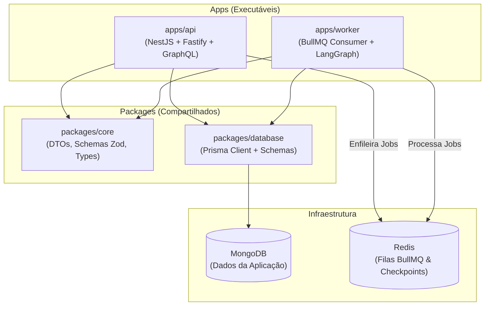

# Context-Whisperer: Documentação de Arquitetura e Engenharia

Bem-vindo ao diretório de documentação arquitetural e de engenharia do backend do **Context-Whisperer**.

Este diretório centraliza o histórico de decisões técnicas, a especificação da arquitetura atual em monorepo e o planejamento das próximas etapas de desenvolvimento.

---

## 🗺️ Mapa de Documentação

| Documento | Descrição | Status |
| :--- | :--- | :--- |
| 📦 [**`arquitetura_monorepo.md`**](./arquitetura_monorepo.md) | Detalhamento da refatoração para Monorepo PNPM, camadas (`apps/`, `packages/`), separação de responsabilidades e convenções de código (`*Model`, Repositories). | **Concluído / Atualizado** |
| 🗄️ [**`migracao_mongodb_prisma.md`**](./migracao_mongodb_prisma.md) | Planejamento e histórico da transição do PostgreSQL + Drizzle para MongoDB + Prisma com Repository Pattern. | **Concluído** |
| ⚡ [**`planejamento_arquitetura.md`**](./planejamento_arquitetura.md) | Visão geral de filas assíncronas (BullMQ), Worker isolado, PubSub/SSE e controle de estado. | **Em Andamento** |
| 🧪 [**`plano_testes.md`**](./plano_testes.md) | Estratégia completa para cobertura de testes unitários e de integração (API, Repositories, Workers e LangGraph). | **Planejado (Próxima Fase)** |

---

## 🧭 Visão Rápida da Arquitetura

---

## 📋 Próximos Passos Imediatos
1. **Implementar a Suíte de Testes ([`plano_testes.md`](./plano_testes.md)):**
   - Testes unitários para Services e Repositories.
   - Testes de integração E2E para GraphQL e fluxos de autenticação.
   - Mocks eficientes para Prisma e filas BullMQ.
2. **Consolidar o Worker BullMQ com LangGraph.**
3. **Implementar Server-Sent Events (SSE) para notificações em tempo real.**
