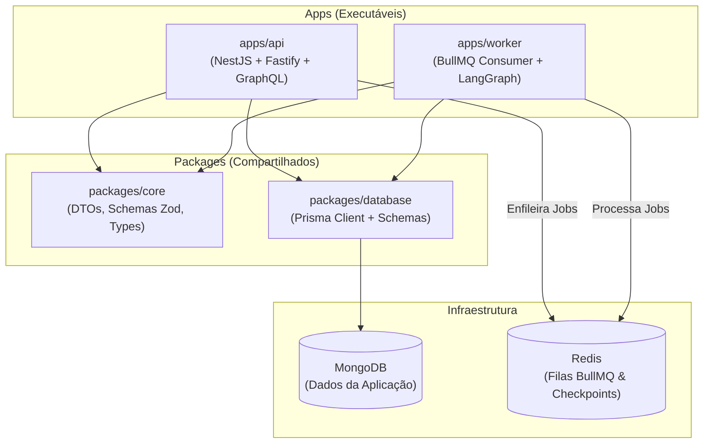

# Context-Whisperer: Documentação de Arquitetura e Engenharia

Bem-vindo ao diretório de documentação arquitetural e de engenharia do backend do **Context-Whisperer**.

Este diretório centraliza o histórico de decisões técnicas, a especificação da arquitetura atual em monorepo e o planejamento das próximas etapas de desenvolvimento.

---

## 🗺️ Mapa de Documentação

| Documento | Descrição | Status |
| :--- | :--- | :--- |
| 📦 [**`arquitetura_monorepo.md`**](./arquitetura_monorepo.md) | Detalhamento da refatoração para Monorepo PNPM, camadas (`apps/`, `packages/`), separação de responsabilidades e convenções de código (`*Model`, Repositories). | **Concluído / Atualizado** |
| 🗄️ [**`migracao_mongodb_prisma.md`**](./migracao_mongodb_prisma.md) | Planejamento e histórico da transição do PostgreSQL + Drizzle para MongoDB + Prisma com Repository Pattern. | **Concluído** |
| 🧪 [**`plano_testes.md`**](./plano_testes.md) | Estratégia completa com 100% das 5 fases de testes unitários e de integração concluídas. | **Concluído (82 testes)** |
| 📡 [**`planejamento_sse_human_in_the_loop.md`**](./planejamento_sse_human_in_the_loop.md) | Arquitetura de notificações via Server-Sent Events (SSE) e ciclo de aprovação/recusa de escopo (HITL). | **Concluído** |
| 📝 [**`planejamento_templates_prompts.md`**](./planejamento_templates_prompts.md) | Gestão de Templates de Prompt e Resposta via Seed/Banco (Append-Only) com seleção automática pelo backend. | **Concluído** |
| 📜 [**`planejamento_logging_pino.md`**](./planejamento_logging_pino.md) | Migração para Structured Logging com Pino, proibição de `console.*` via ESLint e logs estritamente em inglês. | **Concluído** |
| 🛡️ [**`planejamento_middleware_tratamento_erros.md`**](./planejamento_middleware_tratamento_erros.md) | Middleware e Filtro Global de Erros (Fail-Fast / Let it Throw), exceções de domínio e fallback 500. | **Concluído** |

---

## 🧭 Visão Rápida da Arquitetura

---

## 📋 Próximos Passos Imediatos
1. **Implementar a Suíte de Testes ([`plano_testes.md`](./plano_testes.md)):**
   - Testes unitários para Services e Repositories.
   - Testes de integração E2E para GraphQL e fluxos de autenticação.
   - Mocks eficientes para Prisma e filas BullMQ.
2. **Consolidar o Worker BullMQ com LangGraph.**
3. **Implementar Server-Sent Events (SSE) para notificações em tempo real.**
