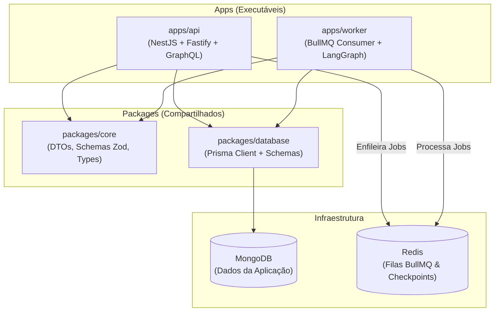

# Context-Whisperer: Documentação de Arquitetura e Engenharia

Bem-vindo ao diretório de documentação arquitetural e de engenharia do backend do **Context-Whisperer**.

Este diretório centraliza o histórico de decisões técnicas, a especificação da arquitetura atual em monorepo e o planejamento das próximas etapas de desenvolvimento.

---

## 🗺️ Mapa de Documentação

| Documento | Descrição | Status |
| :--- | :--- | :--- |
| 📦 [**`arquitetura_monorepo.md`**](./arquitetura_monorepo.md) | Detalhamento da refatoração para Monorepo PNPM, camadas (`apps/`, `packages/`), separação de responsabilidades e convenções de código (`*Model`, Repositories). | **Concluído / Atualizado** |
| 🗄️ [**`migracao_mongodb_prisma.md`**](./migracao_mongodb_prisma.md) | Planejamento e histórico da transição do PostgreSQL + Drizzle para MongoDB + Prisma com Repository Pattern. | **Concluído** |
| 🧪 [**`plano_testes.md`**](./plano_testes.md) | Estratégia completa com 100% das 5 fases de testes unitários e de integração concluídas. | **Concluído (82 testes)** |
| 📡 [**`planejamento_sse_human_in_the_loop.md`**](./planejamento_sse_human_in_the_loop.md) | Arquitetura de notificações via Server-Sent Events (SSE) e ciclo de aprovação/recusa de escopo (HITL). | **Concluído** |
| 📝 [**`planejamento_templates_prompts.md`**](./planejamento_templates_prompts.md) | Gestão de Templates de Prompt e Resposta via Seed/Banco (Append-Only) com seleção automática pelo backend. | **Concluído** |
| 📜 [**`planejamento_logging_pino.md`**](./planejamento_logging_pino.md) | Migração para Structured Logging com Pino, proibição de `console.*` via ESLint e logs estritamente em inglês. | **Concluído** |
| 🛡️ [**`planejamento_middleware_tratamento_erros.md`**](./planejamento_middleware_tratamento_erros.md) | Middleware e Filtro Global de Erros (Fail-Fast / Let it Throw), exceções de domínio e fallback 500. | **Concluído** |
| 🧑‍💻 [**`planejamento_hitl_aprovacao_escopo_artefatos.md`**](./planejamento_hitl_aprovacao_escopo_artefatos.md) | Human-in-the-Loop (Aprovação/Recusa), loop de feedback e geração paralela de artefatos (Requisitos). | **Concluído** |
| ⚖️ [**`planejamento_agente_juiz_causal_evaluation.md`**](./planejamento_agente_juiz_causal_evaluation.md) | Agente Juiz com Avaliação Causal, catálogo de restrições (QualityConstraints) e loop de retrabalho via Dispatcher. | **Concluído** |
| 📚 [**`planejamento_catalogo_curado_quality_constraints.md`**](./planejamento_catalogo_curado_quality_constraints.md) | Catálogo Curado de Restrições (ISO/IEC/IEEE 29148, ISO/IEC 25010, BABOK) e Seleção Contextual Inteligente no Juiz. | **Concluído** |
| 🎯 [**`planejamento_qualidade_geracao_calibracao_juiz.md`**](./planejamento_qualidade_geracao_calibracao_juiz.md) | Qualidade de Geração Inicial (Shift-Left), Escopo Dinâmico MoSCoW e Calibração do Juiz Causal para MVPs. | **Concluído** |
| 📦 [**`planejamento_download_zip_artefatos_dinamicos.md`**](./planejamento_download_zip_artefatos_dinamicos.md) | Download Dinâmico dos Artefatos de Projeto em ZIP (100% GraphQL Query), catálogo `/docs` dinâmico e diretrizes de extensibilidade. | **Concluído** |
| 🏷️ [**`planejamento_persistencia_requisition_name_e_usos.md`**](./planejamento_persistencia_requisition_name_e_usos.md) | Persistência de `Requisition.name`, slugificação de arquivos ZIP, injeção no `scopeAgent` e usos no ecossistema. | **Concluído** |
| 🚀 [**`planejamento_prompt_recomendado_mvp_loop_engineering.md`**](./planejamento_prompt_recomendado_mvp_loop_engineering.md) | Agente de Prompt Recomendado de MVP (`recommendedPromptAgent`), Master Prompt com Loop Engineering, Code-First stack e referenciamento dinâmico. | **Concluído** |
| 🏷️ [**`planejamento_enriquecimento_sse_project_name_e_nome_zip.md`**](./planejamento_enriquecimento_sse_project_name_e_nome_zip.md) | Nomenclatura Semântica do ZIP (`artifacts-...`) & Enriquecimento SSE com `projectName`. | **Concluído** |
| 🌐 [**`planejamento_setup_e_migracao_frontend_monorepo.md`**](./planejamento_setup_e_migracao_frontend_monorepo.md) | Setup, Onboarding e Estratégia de Migração do Frontend para o Monorepo PNPM (`apps/web`). | **Concluído (Fase 1)** |
| 🅰️ [**`planejamento_migracao_frontend_angular_21.md`**](./planejamento_migracao_frontend_angular_21.md) | Migração do Frontend para Angular 21 (LTS) com Standalone, Signals, Zoneless, Control Flow e Application Builder. | **Concluído (Fase 2)** |
| 🔌 [**`planejamento_integracao_frontend_backend.md`**](./planejamento_integracao_frontend_backend.md) | Integração Real Frontend (Angular 21) ↔ Backend (GraphQL + SSE), Queries de Projetos, Sessão e Streaming. | **Concluído (Fase 3)** |
| 🔐 [**`planejamento_autenticacao_e_desmock_frontend.md`**](./planejamento_autenticacao_e_desmock_frontend.md) | Autenticação Real (Login / Cadastro via GraphQL), Route Guards, Gestão de Sessão JWT e Desmockagem Integral do Frontend. | **Concluído (Fase 4)** |
| ⚡ [**`planejamento_sse_stream_refactor_e_notificacoes_toast.md`**](./planejamento_sse_stream_refactor_e_notificacoes_toast.md) | Reformulação Segura do SSE (Zero JWT em Query Params), Notificações Toast Humanizadas & Hidratação Contextual. | **Concluído (Fase 5)** |
| 🪟 [**`planejamento_correcao_aba_escopo_e_simplificacao_abas.md`**](./planejamento_correcao_aba_escopo_e_simplificacao_abas.md) | Correção da Aba de Escopo em Branco (Herança de Parâmetros de Rota) & Simplificação para 2 Abas Essenciais (`Escopo` e `Artefatos`). | **Concluído (Fase 6)** |
| 🔄 [**`planejamento_correcao_integracao_hitl_e_historico_sidebar.md`**](./planejamento_correcao_integracao_hitl_e_historico_sidebar.md) | Auditoria Geral de Endpoints, Correção HITL (Aceite/Rejeição de Escopo), Histórico Leve com Lazy Loading e Layout da Sidebar. | **Concluído (Fase 7)** |

---

## 🧭 Visão Rápida da Arquitetura

```mermaid
graph TD
    subgraph Apps ["Apps (Executáveis)"]
        API["apps/api<br/>(NestJS + Fastify + GraphQL)"]
        Worker["apps/worker<br/>(BullMQ Consumer + LangGraph)"]
    end

    subgraph Packages ["Packages (Compartilhados)"]
        Core["packages/core<br/>(DTOs, Schemas Zod, Types)"]
        DB["packages/database<br/>(Prisma Client + Schemas)"]
    end

    subgraph Infra ["Infraestrutura"]
        Mongo[("MongoDB<br/>(Dados da Aplicação)")]
        Redis[("Redis<br/>(Filas BullMQ & Checkpoints)")]
    end

    API --> Core
    API --> DB
    Worker --> Core
    Worker --> DB
    
    API -- "Enfileira Jobs" --> Redis
    Worker -- "Processa Jobs" --> Redis
    
    DB --> Mongo
```

---

## 🧩 Diretriz Estratégica: Processo Incremental de Quality Constraints & Foco em MVP

A curadoria e aplicação das restrições de qualidade (`QualityConstraint`) pelo Agente Juiz (`judgeAgent`) segue dois pilares fundamentais:

### 1. Curadoria Incremental por Artefato Intermediário
- **Estado Atual:** No workflow atual, apenas o primeiro artefato intermediário está implementado: o documento de **Requisitos (`REQUIREMENTS`)**, gerado pelo `requirementsAgent`. Portanto, o catálogo de restrições em banco cobre exclusivamente esse artefato.
- **Evolução Incremental:** À medida que novos agentes especialistas forem desenvolvidos para gerar novos artefatos intermediários (ex: Agente de Arquitetura e Diagramas C4, Agente de Modelagem de Dados/ERD, Agente de Contratos OpenAPI/REST, Agente de Histórias de Usuário), **deverá ser realizada uma etapa dedicada de curadoria de novas `QualityConstraint`s específicas para o domínio de cada artefato**. Essas regras serão registradas no banco (via seed e migrações) e vinculadas ao respectivo `targetArtifactType` (ex: `ARCHITECTURE_DOC`, `DATA_MODEL`, `API_SPEC`).

### 2. Filosofia Pragmatic MVP vs. Over-Engineering Corporativo
- O Context-Whisperer é projetado para acelerar o ciclo de ideação, validação e desenvolvimento de **Produtos Mínimos Viáveis (MVPs)** e protótipos funcionais.
- As restrições não devem impor burocracia ou complexidades corporativas prematuras a um MVP (como exigir SLA de 99.99%, RTO/RPO de disaster recovery ou redundância multi-região para um protótipo inicial).
- **Foco da Avaliação em MVPs:**
  - **Integridade de Escopo:** Cobertura estrita dos itens *Must Have* e veto rigoroso a *Scope Creep* (itens do *Won't Have* ou fora do escopo aprovado).
  - **Higiene de Engenharia:** Atomicidade, critérios de aceite verificáveis e ausência de termos ambíguos.
  - **Segurança Essencial:** Tratamento adequado de autenticação, sessões e proteção de dados sensíveis/LGPD quando aplicável.
  - **Sobriedade em Infraestrutura:** Restrições pesadas de disponibilidade corporativa ou desempenho extremo devem ser tratadas com parcimônia, atuando preferencialmente como advertências (`WARNING`) ou apenas quando o escopo do usuário solicitar explicitamente requisitos de alta escalabilidade.

---

## 📋 Próximos Passos Imediatos
1. **Novos Agentes Especialistas de Artefatos Intermediários:**
   - Agente de Arquitetura Técnica / Diagramação C4.
   - Agente de Modelagem de Dados e Schemas.
   - Curadoria incremental das respectivas `QualityConstraint`s alinhadas à maturidade do MVP.
2. **Consolidação do Streaming SSE:**
   - Refinamento das notificações em tempo real de transição de estado e checkpoints do LangGraph.
3. **Evolução dos Testes e Avaliações Causal:**
   - Acompanhamento das métricas de aprovação e refinamento dos pesos e remédios contrafactuais.

