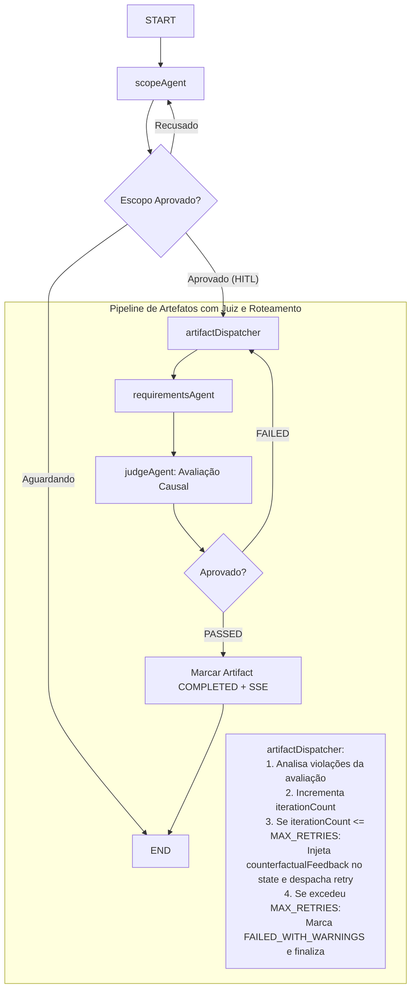

# Planejamento: Agente Juiz com Avaliação Causal (Causal Evaluation) e Loop de Retrabalho

Este documento estabelece a arquitetura, modelagem de dados, regras de qualidade e fluxo de orquestração para o **Agente Juiz (`judgeAgent`)** no Context-Whisperer. O agente atua como validador técnico dos artefatos gerados (iniciando por `REQUIREMENTS`), utilizando **Avaliação Causal (Causal Evaluation)** para diagnosticar a causa-raiz de reprovações e alimentar um ciclo de auto-correção orquestrado pelo **Dispatcher**.

---

## 1. Visão Geral e Conceito de Avaliação Causal

### 🎯 Por que Avaliação Causal e não apenas LLM-as-a-Judge comum?
Em sistemas tradicionais de LLM-as-a-Judge, o modelo avaliador normalmente retorna uma nota (1 a 5) ou um booleano (`APPROVED`/`REJECTED`) acompanhado de uma justificativa genérica. Isso gera dois problemas graves:
1. **Falta de Acionabilidade:** O agente especialista não sabe *exatamente* o que mudar para consertar o artefato.
2. **Instabilidade no Loop de Refinamento:** O especialista tenta adivinhar a correção, muitas vezes piorando outras seções ou caindo em alucinação circular.

A **Avaliação Causal** baseia-se em contra-modelos e raciocínio contrafactual:
- **Causa Observada (Root Cause):** O que foi decidido pelo gerador que gerou o defeito (ex: *omissão de um Must Have*, *adjetivo subjetivo sem métrica em RNF*).
- **Violação Identificada (Constraint Violation):** Qual regra formal da engenharia de software foi descumprida.
- **Remédio Contrafactual (Counterfactual Remedy):** A instrução precisa respondendo à pergunta: *"Se o agente alterar o trecho X para a formulação Y, a restrição Z será satisfeita e o artefato aprovado"*.

---

## 2. Política de Decisão Causal Híbrida: Veto Constraints + Nota de Corte (Configurável via Env)

A aprovação ou reprovação **não** depende exclusivamente de uma nota de corte numérica, evitando o risco de que um artefato bem redigido compense um erro fatal (como a omissão de um *Must Have* essencial). Adota-se o modelo híbrido:

### 🛡️ 1. Portão de Veto (Hard / Critical Constraints):
- Toda regra classificada com `severity: "CRITICAL"` funciona como um **veto imediato**.
- Se o juiz diagnosticar qualquer violação crítica, o artefato é **automaticamente reprovado (`status: "FAILED"`)**, independentemente da nota numérica.

### 🎯 2. Nota de Corte Ponderada (Soft / Rubric Score = 8.0):
- Caso **nenhuma** violação crítica tenha ocorrido, aplica-se a nota de corte estabelecida em **`JUDGE_MIN_PASSING_SCORE` (padrão: `8.0` em escala de 0.0 a 10.0)**.
- **Por que 8.0 é o valor ideal?**
  - Em engenharia de requisitos, uma nota 7.0 frequentemente aceita especificações com lacunas (ex: critérios de aceite superficiais ou RNFs sem limites claros).
  - A nota **8.0** exige que o artefato atinja o patamar *B+/A-* (pronto para desenvolvimento, coeso e sem ambiguidades perigosas). Artefatos na faixa de 6.5 a 7.9 geralmente acumulam 2 ou 3 `WARNINGs` menores que o loop de feedback causal facilmente corrige em uma segunda iteração.
- Se `score >= MIN_PASSING_SCORE`: o artefato é **aprovado (`status: "PASSED"`)**. Eventuais `WARNINGs` são preservados para auditoria, mas não bloqueiam o fluxo.
- Se `score < MIN_PASSING_SCORE`: o artefato é **reprovado (`status: "FAILED"`)** por insuficiência técnica global.

### ⚙️ 3. Separação de Responsabilidades (IA vs Backend Determinístico):
- **O Agente Juiz (LLM):** Responsável estritamente pelo diagnóstico semântico (extrair evidências, relacionar com as constraints violadas, sugerir o remédio e calcular o score parcial).
- **O Backend (TypeScript):** Aplica deterministicamente a regra de aprovação lendo as variáveis de ambiente:
  ```typescript
  const minPassingScore = Number(process.env.JUDGE_MIN_PASSING_SCORE ?? 8.0);
  const maxRetries = Number(process.env.JUDGE_MAX_RETRIES ?? 2);

  const hasCritical = evaluation.violations?.some((v) => v.severity === 'CRITICAL');
  const isApproved = !hasCritical && evaluation.score >= minPassingScore;
  const finalStatus = isApproved ? 'PASSED' : 'FAILED';
  ```

### 🔧 4. Parâmetros de Configuração via Ambiente:
| Variável de Ambiente | Valor Padrão | Descrição |
| :--- | :--- | :--- |
| `JUDGE_MIN_PASSING_SCORE` | `8.0` | Nota mínima necessária para aprovação quando não há violações críticas. |
| `JUDGE_MAX_RETRIES` | `2` | Número máximo de tentativas de auto-correção antes de interromper o ciclo. |

---

## 3. O Papel do Dispatcher no Loop de Retrabalho

A decisão de **não** enviar o feedback de avaliação diretamente para os especialistas, mas sim através do **`artifactDispatcher`**, é o padrão arquitetural ideal pelos seguintes motivos:

1. **Roteamento Cirúrgico (Targeted Fan-Out):**
   - Quando o projeto gerar múltiplos artefatos em paralelo (`REQUIREMENTS`, `ARCHITECTURE_DOC`, `API_SPEC`), o juiz avaliará cada um individualmente.
   - O Dispatcher avalia os resultados e aciona **apenas** os agentes que foram reprovados, poupando tokens e tempo de processamento dos artefatos que já foram aprovados.
2. **Isolamento de Feedback:**
   - O especialista de Requisitos recebe apenas o feedback causal que diz respeito a Requisitos; ele não deve ser poluído com diagnósticos de outros artefatos.
3. **Controle de Ciclo e Disjuntor (Circuit Breaker):**
   - O Dispatcher controla o contador de tentativas (`iterationCount`) de cada artefato com base em `JUDGE_MAX_RETRIES` (default: 2).
   - Se um artefato falhar repetidamente e atingir o limite (`iterationCount >= maxRetries`), o Dispatcher interrompe o loop para aquele artefato, marcando-o como `FAILED_WITH_WARNINGS` e evitando custos descontrolados de API.
4. **Gerenciamento de Estado no MongoDB:**
   - O Dispatcher atualiza o status do `Artifact` (ex: `DRAFT` ➔ `NEEDS_REVISION` ➔ `COMPLETED`) e orquestra as transições antes de invocar os especialistas.

---

## 4. Captura de Métricas de IA e Auditoria

Para persistir métricas precisas de consumo e desempenho no banco sem onerar a aplicação:

### 📊 Métricas a serem capturadas:
- `promptTokens`: Tokens consumidos no prompt do juiz.
- `completionTokens`: Tokens consumidos na resposta estruturada.
- `totalTokens`: Soma total de tokens da avaliação.
- `latencyMs`: Tempo exato de resposta do modelo em milissegundos.
- `model`: Identificador exato da LLM (ex: `gpt-4o-2024-08-06`).
- `estimatedCostUsd`: Custo estimado com base na tabela da OpenAI (opcional para relatórios).

### 🛠️ Mecanismo de Extração via LangChain:
Ao invocar `withStructuredOutput`, utilizaremos a flag `{ includeRaw: true }`, que retorna simultaneamente o schema validado e a mensagem bruta (`AIMessage`) contendo os metadados oficiais do provedor:

```typescript
const structuredJudge = model.withStructuredOutput(CausalEvaluationSchema, {
  includeRaw: true,
});

const startTime = performance.now();
const response = await structuredJudge.invoke(evaluationPrompt);
const latencyMs = Math.round(performance.now() - startTime);

const parsed = response.parsed; // Schema Zod validado
const rawMessage = response.raw as AIMessage; // Metadados da chamada

const promptTokens =
  rawMessage.usage_metadata?.input_tokens ??
  (rawMessage.response_metadata?.token_usage as any)?.prompt_tokens ?? 0;

const completionTokens =
  rawMessage.usage_metadata?.output_tokens ??
  (rawMessage.response_metadata?.token_usage as any)?.completion_tokens ?? 0;

const modelName =
  (rawMessage.response_metadata?.model_name as string) ??
  process.env.OPENAI_MODEL ?? 'gpt-4o';
```

---

## 5. Catálogo de Qualidade: Seeds de `QualityConstraint`

A qualidade das restrições é determinante para a consistência da avaliação. Criaremos um catálogo formal no `seed.js` para o tipo de artefato `REQUIREMENTS`:

| Código | Tipo | Severidade | Descrição da Regra | Remédio / Ação Corretiva |
| :--- | :--- | :--- | :--- | :--- |
| **`REQ_MOSCOW_COVERAGE`** | `INVARIANT` | `CRITICAL` | 100% das funcionalidades categorizadas como **Must Have** no escopo aprovado devem possuir pelo menos um Requisito Funcional (RF) explícito correspondente. | Identifique o Must Have omitido e formule um novo RF descrevendo seu comportamento. |
| **`REQ_NO_SCOPE_CREEP`** | `NEGATIVE_CONSTRAINT` | `CRITICAL` | É estritamente proibido incluir módulos ou requisitos que constem na seção **Won't Have (Fora de Escopo)** ou funcionalidades que desvirtuem o objetivo principal. | Remova o requisito incompatível ou ajuste o escopo para respeitar os limites do MVP. |
| **`REQ_MEASURABLE_NON_FUNCTIONAL`** | `NEGATIVE_CONSTRAINT` | `CRITICAL` | Requisitos Não-Funcionais (RNF) não devem conter termos vagos ("rápido", "intuitivo", "escalável") sem métrica objetiva (latência em ms, uptime em %, throughput). | Substitua adjetivos subjetivos por métricas quantificáveis (ex: percentil 95 abaixo de 300ms). |
| **`REQ_NO_PREMATURE_TECH_STACK`** | `NEGATIVE_CONSTRAINT` | `WARNING` | Requisitos funcionais de negócio não devem prescrever detalhes de implementação (tabelas SQL específicas, portas HTTP, bibliotecas internas), exceto se exigido pelo negócio. | Foque no comportamento e na regra de negócio observável, delegando a arquitetura interna aos artefatos técnicos posteriores. |
| **`REQ_BUSINESS_RULES_INTEGRITY`** | `INVARIANT` | `CRITICAL` | Regras de Negócio (RN) devem expressar condições lógicas claras, limites de domínio ou políticas de permissão, não sendo meras repetições dos RFs. | Reformule a regra expressando a premissa condicional (SE... ENTÃO... SENÃO...) ou a restrição de domínio. |
| **`REQ_ATOMICITY_AND_TESTABILITY`** | `INVARIANT` | `WARNING` | Cada requisito deve descrever uma única capacidade coesa e ser verificável por um caso de teste claro de QA. | Decomponha requisitos compostos/monolíticos em itens atômicos e independentes. |

---

## 6. Modelagem do Banco de Dados (Prisma / MongoDB)

Adicionaremos as seguintes collections em `packages/database/prisma/schema.prisma`:

```prisma
model ArtifactEvaluation {
  id                     String       @id @default(auto()) @map("_id") @db.ObjectId
  artifactId             String       @db.ObjectId
  artifact               Artifact     @relation(fields: [artifactId], references: [id])
  requisitionId          String       @db.ObjectId
  requisition            Requisition  @relation(fields: [requisitionId], references: [id])
  
  iteration              Int          @default(1)
  status                 String       // "PASSED" | "FAILED"
  score                  Float        // 0.0 a 10.0
  
  // Diagnóstico Causal Estruturado
  summary                String
  rootCauses             String[]
  violations             Json?        // Array de objetos { ruleCode, severity, location, cause, remedy }
  counterfactualFeedback String?      // Texto instrucional para a auto-correção
  
  // Métricas de IA & Auditoria
  model                  String?
  promptTokens           Int?
  completionTokens       Int?
  totalTokens            Int?
  latencyMs              Int?
  
  createdAt              DateTime     @default(now())
}

model QualityConstraint {
  id           String       @id @default(auto()) @map("_id") @db.ObjectId
  artifactType String       // "REQUIREMENTS", "API_SPEC", etc.
  code         String       @unique
  title        String
  description  String
  type         String       // "NEGATIVE_CONSTRAINT" | "INVARIANT"
  severity     String       // "CRITICAL" | "WARNING"
  remedyHint   String?
  isActive     Boolean      @default(true)
  
  createdAt    DateTime     @default(now())
  updatedAt    DateTime     @updatedAt
}
```

Atualizar o model `Artifact` existente:
```prisma
model Artifact {
  // ... campos existentes
  evaluations  ArtifactEvaluation[]
}
```

---

## 7. Topologia do Grafo LangGraph & Ciclo de Rework



### Mecânica do State no LangGraph:
No `GraphState`:
- `evaluationFeedback?: Record<string, string>` (mapa de `artifactType -> feedback`)
- `artifactIterations?: Record<string, number>` (mapa de `artifactType -> tentativas`)
- `currentEvaluationId?: string`

---

## 8. Roteiro de Implementação em Fases

### 📌 Fase 1: Schema Prisma e Seeds de Restrições
- [x] Adicionar models `ArtifactEvaluation` e `QualityConstraint` em `schema.prisma`.
- [x] Executar `pnpm run db:generate`.
- [x] Cadastrar os templates do Juiz em `seed.js`:
  - `judge_requirements_prompt`: prompt com instruções de avaliação causal e regras de inferência.
- [x] Cadastrar o catálogo inicial das 6 `QualityConstraint`s de requisitos em `seed.js`.
- [x] Compilar `packages/database`.

### 📌 Fase 2: Schemas Zod e Estado no Core (`packages/core`)
- [x] Criar `packages/core/src/agents/langgraph/schemas/evaluation.schema.ts`:
  - `CausalViolationSchema`: `{ ruleCode, severity, location, cause, remedy }`.
  - `CausalEvaluationSchema`: `{ status, score, summary, rootCauses, violations, counterfactualFeedback }`.
- [x] Atualizar `GraphState` em `packages/core/src/agents/langgraph/state.ts` com campos de iteração e feedback causal.
- [x] Exportar novos schemas em `packages/core/src/index.ts` e compilar.

### 📌 Fase 3: Nó do Agente Juiz (`judge-agent.node.ts`)
- [x] Criar `apps/worker/src/workflows/agents/nodes/judge-agent.node.ts`.
- [x] Buscar templates e restrições ativas do MongoDB para o tipo de artefato avaliado.
- [x] Executar chamada estruturada via `withStructuredOutput(CausalEvaluationSchema, { includeRaw: true })`.
- [x] Extrair tokens e latência (`performance.now()`).
- [x] Persistir resultado em `ArtifactEvaluation`.

### 📌 Fase 4: Dispatcher como Roteador de Retrabalho e Atualização do Grafo
- [x] Atualizar `artifactDispatcher`:
  - Modo inicial: cria artefatos e emite SSE `ARTIFACT_GENERATING`.
  - Modo retrabalho (quando vindo do juiz): inspeciona laudo da avaliação, incrementa iteração, empacota feedback causal e aciona cirurgicamente apenas os agentes reprovados.
  - Circuit breaker: impede loop infinito caso atinja o limite máximo (`MAX_RETRIES = 2`).
- [x] Atualizar `requirementsAgent` para incorporar o feedback contrafactual do juiz ao reescrever.
- [x] Configurar as novas conditional edges no `graph.ts`.

### 📌 Fase 5: Testes Unitários e de Integração
- [x] Testes unitários para `judgeAgent`:
  - Cenário de aprovação (artefato conforme).
  - Cenário de reprovação com diagnóstico causal estruturado.
  - Validação de captura e persistência de métricas de tokens e latência.
- [x] Testes unitários para `artifactDispatcher` no modo retrabalho (controle de retries e circuit breaker).
- [x] Testes unitários para `requirementsAgent` (geração inicial vs refinamento com feedback do juiz).
- [x] Teste de integração assíncrono do fluxo E2E de auto-correção:
  - Geração com defeito ➔ Reprovação pelo Juiz ➔ Roteamento pelo Dispatcher ➔ Correção pelo Especialista ➔ Aprovação final.
- [x] Validação estrita de lint e build em todo o monorepo.
