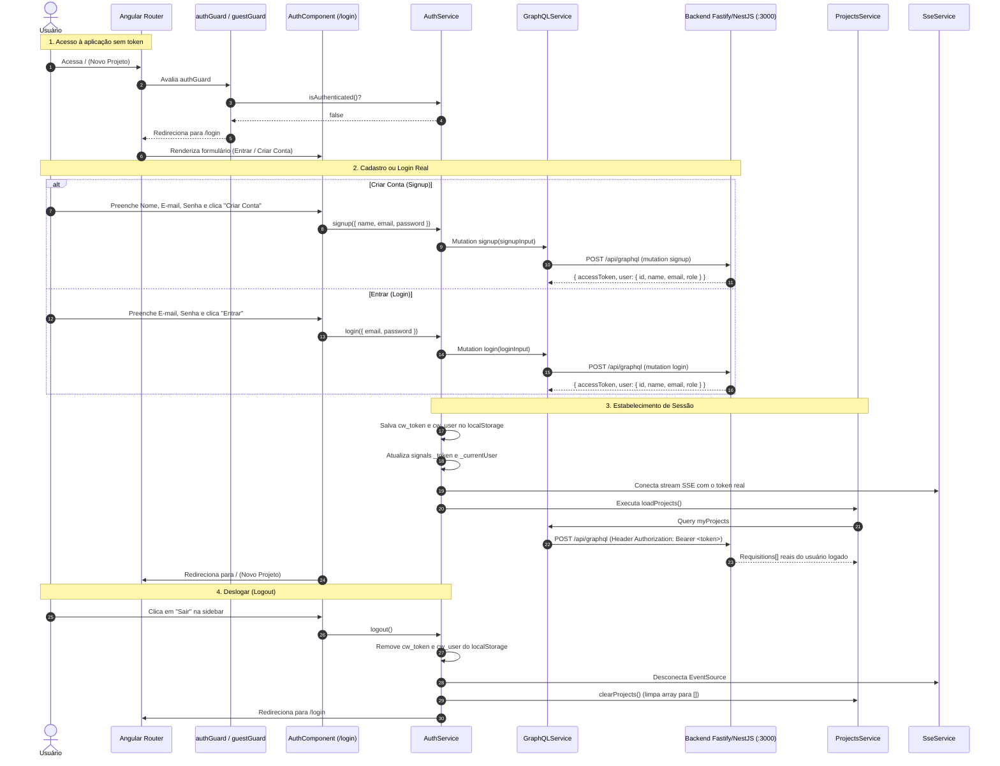

# 📋 Plano de Implementação: Autenticação Real (Login / Cadastro) & Desmock do Frontend

> **Status:** Concluído / Implementado  
> **Escopo:** Substituir as credenciais hardcoded e dados estáticos do frontend Angular 21 (`apps/web`) por uma tela real de Autenticação (Login e Cadastro), proteção por Route Guards (`authGuard`/`guestGuard`), perfil de usuário e logout na barra lateral, e desmockagem integral do estado de projetos no `ProjectsService`.

---

## 🎯 1. Visão Geral e Justificativa

Atualmente, embora as queries e mutations GraphQL já existam e funcionem no backend (`apps/api`), o frontend ainda possui diversos resquícios de dados simulados (mocks) e comportamentos de atalho:

1. **Auto-login silencioso de desenvolvimento (`AuthService`):** Um método `ensureAuthenticated()` tenta logar ou cadastrar automaticamente com credenciais fixas (`dev@context-whisperer.local`), impedindo o uso real de contas distintas.
2. **Projetos mockados pré-carregados (`ProjectsService`):** O signal `_projects` inicializa com `mockProjects` ("Delivery Express PIX" com escopo e artefatos falsos). Qualquer usuário que abre a aplicação vê esses dados antes ou em caso de falha de carregamento.
3. **Fallback silencioso de criação:** Ao falhar a criação de projeto na API, um projeto local com ID fake `proj-${Date.now()}` é inserido na memória sem avisar o usuário.
4. **Ausência de tela de Login/Cadastro e Route Guards:** Não há rota `/login` (ou `/auth`) e qualquer visitante anônimo consegue navegar nas páginas de criação e visualização de projetos.
5. **Sidebar sem dados de usuário ou Logout:** A barra lateral não exibe o nome, e-mail ou avatar do usuário autenticado, nem oferece opção de deslogar.

Este plano define a arquitetura e os passos para **eliminar todos os mocks de dados de usuário e projetos**, implementando um fluxo de autenticação completo de ponta a ponta.

---

## 🗺️ 2. Arquitetura do Fluxo de Autenticação



---

## 🔍 3. Diagnóstico e Itens a Desmockar

| Componente / Arquivo | Estado Atual (Mockado) | Novo Estado (Real / Desmockado) |
| :--- | :--- | :--- |
| `apps/web/src/app/core/services/auth.service.ts` | `ensureAuthenticated()` com credenciais fixas `dev@context-whisperer.local` | Métodos `login()`, `signup()`, `logout()`, `initSession()`, sem credenciais fake |
| `apps/web/src/app/core/services/projects.service.ts` | `_projects = signal<Project[]>(mockProjects);` | `_projects = signal<Project[]>([]);` — limpo por padrão, populado exclusivamente via GraphQL `myProjects` |
| `apps/web/src/app/core/services/projects.service.ts` | Fallback de `createProject` cria projeto local com escopo fake | Propaga erro real com aviso ao usuário caso a requisição falhe |
| `apps/web/src/app/app.routes.ts` | Rotas abertas sem qualquer restrição de login | Protegidas com `canActivate: [authGuard]` e `/login` com `[guestGuard]` |
| `apps/web/src/app/shared/components/app-sidebar/app-sidebar.component.ts` | Sem dados de usuário e sem botão de deslogar | Rodapé com avatar do usuário, nome, e-mail e botão "Sair" funcional |
| `apps/web/src/app/app.component.ts` | Exibe barra lateral em todas as telas, mesmo sem login | Oculta a barra lateral quando em `/login` (`@if (auth.isAuthenticated())`) |
| `apps/web/src/app/features/auth/auth.component.ts` | Não existe | Nova tela com abas "Entrar" e "Criar Conta", validação inline e feedback de erro |

---

## 🛠️ 4. Proposta Detalhada de Mudanças

### 4.1. Camada de Autenticação (`apps/web/src/app/core/services/auth.service.ts`)
#### [MODIFY] `apps/web/src/app/core/services/auth.service.ts`
- Remover o bloco com credenciais `dev@context-whisperer.local`.
- Implementar:
  - `login(credentials: { email, password }): Promise<void>`
  - `signup(data: { name, email, password }): Promise<void>`
  - `logout(): void`
  - `initSession(): Promise<boolean>` (validação do token existente contra a query `me`)
- Gerenciar signals: `token`, `currentUser`, `isAuthenticated`.

### 4.2. Route Guards (`apps/web/src/app/core/guards/auth.guard.ts`)
#### [NEW] `apps/web/src/app/core/guards/auth.guard.ts`
- `authGuard`: Se `!auth.isAuthenticated()`, retorna `router.createUrlTree(['/login'])`.
- `guestGuard`: Se `auth.isAuthenticated()`, retorna `router.createUrlTree(['/'])`.

### 4.3. Nova Tela de Autenticação (`apps/web/src/app/features/auth/auth.component.ts`)
#### [NEW] `apps/web/src/app/features/auth/auth.component.ts`
- Card centralizado com estilo visual dark mode refinado (Tailwind v4).
- Seletor de abas:
  - **Aba "Entrar"**: Inputs de E-mail e Senha + Botão "Entrar no Context Whisperer".
  - **Aba "Criar Conta"**: Inputs de Nome Completo, E-mail, Senha (mínimo 6 caracteres) + Botão "Criar Conta".
- Estados reativos:
  - `mode = signal<'login' | 'signup'>('login')`
  - `loading = signal<boolean>(false)`
  - `errorMessage = signal<string | null>(null)`
- Integração direta com `authService.login()` e `authService.signup()`.

### 4.4. Rotas da Aplicação (`apps/web/src/app/app.routes.ts`)
#### [MODIFY] `apps/web/src/app/app.routes.ts`
- Adicionar rota `/login` com `guestGuard`.
- Proteger rotas `/`, `/templates`, `/projects/:id` com `authGuard`.

### 4.5. Limpeza de Mocks no [`ProjectsService`](file:///C:/Users/joker/OneDrive/Documents/github/context-whisperer_backend/apps/web/src/app/core/services/projects.service.ts)
#### [MODIFY] `apps/web/src/app/core/services/projects.service.ts`
- Substituir `mockProjects` na inicialização do signal por `[]`:
  ```typescript
  private readonly _projects = signal<Project[]>([]);
  ```
- Adicionar `clearProjects()` para zerar a lista ao deslogar.
- No `createProject()`, em vez de criar um projeto fake com ID temporal caso a API falhe, lançar erro para que a interface informe ao usuário: "Não foi possível criar o projeto no servidor. Verifique sua conexão."

### 4.6. Barra Lateral e Perfil do Usuário (`app-sidebar.component.ts`)
#### [MODIFY] `apps/web/src/app/shared/components/app-sidebar/app-sidebar.component.ts`
- Adicionar rodapé fixo ao final do `aside`:
  - Avatar circular com as iniciais do usuário logado (ex: `LU` para `Luiz User`).
  - Nome do usuário e e-mail com truncamento elegante.
  - Botão com ícone de `logout` chamando `authService.logout()`.
- Exibir empty state amigável no histórico:
  ```html
  @if (projects().length === 0) {
    <div class="px-2.5 py-4 text-center text-xs text-muted-foreground/80 border border-dashed border-sidebar-border rounded-md">
      Nenhum projeto ainda.<br />Crie seu primeiro MVP acima!
    </div>
  }
  ```

### 4.7. Layout Mestre (`app.component.ts`)
#### [MODIFY] `apps/web/src/app/app.component.ts`
- Ocultar a barra lateral quando o usuário não estiver autenticado (`@if (auth.isAuthenticated()) { <app-sidebar /> }`).
- Na inicialização (`ngOnInit`), invocar `auth.initSession()`. Se autenticado, conectar SSE e carregar projetos.

---

## 🧪 5. Plano de Verificação e Homologação

### Testes Automatizados
```powershell
# 1. Checagem estática e linter sem erros
pnpm run lint

# 2. Compilação estrita de todos os pacotes e aplicação Angular
pnpm run build

# 3. Testes unitários do monorepo (API + Worker)
pnpm test
```

### Validação Manual (Ponta a Ponta)
1. **Acesso Anônimo:** Acessar `http://localhost:8080/` em aba anônima; verificar se é redirecionado automaticamente para `/login`.
2. **Cadastro Real:** Preencher a aba "Criar Conta" com um usuário novo (ex: `teste@empresa.com`); verificar se o usuário é criado no MongoDB e autenticado automaticamente com JWT retornado.
3. **Logout:** Clicar no botão "Sair" na barra lateral; verificar se o token é removido do `localStorage` e a aplicação retorna para `/login`.
4. **Login Real:** Entrar com as credenciais recém-criadas na aba "Entrar"; verificar se a sessão é restaurada com sucesso.
5. **Histórico Vazio Real:** Observar que a barra lateral agora mostra o empty state amigável ("Nenhum projeto ainda"), sem nenhum projeto mockado ("Delivery Express PIX").
6. **Criação de Projeto Real:** Criar um projeto real e acompanhar a transição para `/projects/:id/scope` associado ao ID real do usuário logado.
