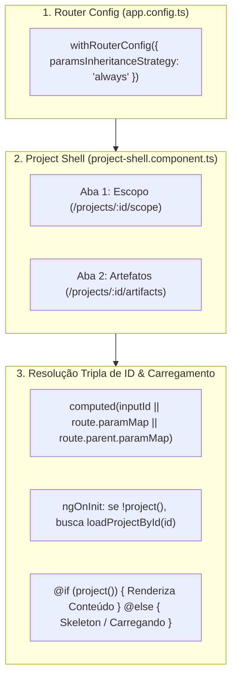

# 📋 Planejamento: Correção da Aba de Escopo & Simplificação para 2 Abas (Escopo e Artefatos)

> **Status:** Concluído e Validado (Build 100%, 136 Testes Passando, Linter 0 erros)  
> **Problema 1:** A aba "Escopo" dentro do projeto não exibe nada, ficando vazia.  
> **Problema 2:** A interface possui 4 abas (`Escopo`, `Orquestração`, `Juiz`, `Artefatos`), das quais somente 2 (`Escopo` e `Artefatos`) são realmente relevantes para o usuário final.

---

## 🎯 1. Diagnóstico da Causa Raiz

### Por que a aba "Escopo" ficava vazia?
1. **Falta de Herança de Parâmetros de Rota (`paramsInheritanceStrategy`):**
   - O componente mestre (`ProjectShellComponent`) é registrado na rota pai `projects/:id`.
   - A aba de escopo (`ProjectScopeComponent`) é uma rota filha `{ path: "scope", ... }`.
   - No Angular Router, a estratégia padrão de herança de parâmetros é `'emptyOnly'`. Rotas com caminhos não-vazios (como `"scope"` ou `"artifacts"`) **não herdam** os parâmetros da rota pai por padrão via `withComponentInputBinding()`.
   - Como resultado, `this.id()` em `ProjectScopeComponent` avaliava para `undefined`.
2. **Computação e Renderização do Projeto:**
   - O componente computa o projeto com:
     ```typescript
     readonly project = computed(() => this.projectsService.getProjectById(this.id()));
     ```
   - Com `this.id()` indefinido, `getProjectById(undefined)` retorna `undefined`.
   - No template HTML:
     ```html
     @if (project(); as p) { ... }
     ```
     A expressão avaliava para `false` e o Angular não renderizava nada dentro de `<router-outlet>`, deixando a aba completamente em branco.
3. **Ausência de Fallback de Carregamento (`ngOnInit` e `@else`):**
   - Se o usuário acessasse a URL `/projects/:id/scope` diretamente (ou desse F5), o componente não realizava busca preventiva via `loadProjectById`, nem exibia um estado de carregamento amigável (`@else`).

---

## 🗺️ 2. Arquitetura da Solução & Simplificação de Abas



---

## 🛠️ 3. Mudanças Propostas

---

### Componente 1: Configuração do Router (`apps/web`)

#### [MODIFY] [`apps/web/src/app/app.config.ts`](file:///C:/Users/joker/OneDrive/Documents/github/context-whisperer_backend/apps/web/src/app/app.config.ts)
- Adicionar `withRouterConfig({ paramsInheritanceStrategy: "always" })` aos provedores do roteador.
- Garante que rotas filhas recebam todos os parâmetros de rotas ancestrais (`:id`) automaticamente via `input()`.

```typescript
provideRouter(
  routes,
  withComponentInputBinding(),
  withRouterConfig({ paramsInheritanceStrategy: "always" }),
  withViewTransitions(),
),
```

---

### Componente 2: Roteamento da Aplicação (`apps/web`)

#### [MODIFY] [`apps/web/src/app/app.routes.ts`](file:///C:/Users/joker/OneDrive/Documents/github/context-whisperer_backend/apps/web/src/app/app.routes.ts)
- Manter como rotas primárias ativas apenas `scope` e `artifacts`.
- Configurar redirecionamentos transparentes para que eventuais acessos a `orchestration` e `evaluation` sejam direcionados para `artifacts`.

```typescript
children: [
  {
    path: "",
    pathMatch: "full",
    redirectTo: "scope",
  },
  {
    path: "scope",
    loadComponent: () =>
      import("@features/project/scope/project-scope.component").then(
        (m) => m.ProjectScopeComponent,
      ),
    title: "Escopo — Context Whisperer",
  },
  {
    path: "artifacts",
    loadComponent: () =>
      import("@features/project/artifacts/project-artifacts.component").then(
        (m) => m.ProjectArtifactsComponent,
      ),
    title: "Artefatos — Context Whisperer",
  },
  {
    path: "orchestration",
    redirectTo: "artifacts",
  },
  {
    path: "evaluation",
    redirectTo: "artifacts",
  },
]
```

---

### Componente 3: Shell do Projeto — Redução para 2 Abas (`apps/web`)

#### [MODIFY] [`apps/web/src/app/features/project/shell/project-shell.component.ts`](file:///C:/Users/joker/OneDrive/Documents/github/context-whisperer_backend/apps/web/src/app/features/project/shell/project-shell.component.ts)
- Atualizar a constante `STEPS` para conter apenas as 2 abas solicitadas:
  ```typescript
  const STEPS: StepTab[] = [
    { to: "scope", label: "Escopo" },
    { to: "artifacts", label: "Artefatos" },
  ];
  ```
- Mantém o design visual limpo e focado no valor de negócio para o usuário.

---

### Componente 4: Correção e Blindagem da Aba de Escopo (`apps/web`)

#### [MODIFY] [`apps/web/src/app/features/project/scope/project-scope.component.ts`](file:///C:/Users/joker/OneDrive/Documents/github/context-whisperer_backend/apps/web/src/app/features/project/scope/project-scope.component.ts)
1. **Resolução de ID Tripla Camada:**
   - Injetar `ActivatedRoute`.
   - Computar `id` a partir de `this.inputId()`, `this.route.snapshot.paramMap.get('id')` ou `this.route.parent?.snapshot.paramMap.get('id')`.
2. **Carregamento Preventivo em `ngOnInit`:**
   - Se o projeto não estiver no cache em memória do serviço, chamar `await this.projectsService.loadProjectById(this.id())`.
3. **Fluxo de Aprovação HITL Atualizado:**
   - Ao aprovar o escopo (`approve()`), redirecionar o usuário para a aba de artefatos:
     ```typescript
     await this.projectsService.approveScope(id);
     this.router.navigate(["/projects", id, "artifacts"]);
     ```
4. **Estado de Carregamento Amigável:**
   - Adicionar bloco `@else` informando carregamento do projeto ou projeto não encontrado caso a busca falhe.

---

### Componente 5: Blindagem da Aba de Artefatos (`apps/web`)

#### [MODIFY] [`apps/web/src/app/features/project/artifacts/project-artifacts.component.ts`](file:///C:/Users/joker/OneDrive/Documents/github/context-whisperer_backend/apps/web/src/app/features/project/artifacts/project-artifacts.component.ts)
1. Aplicar a mesma resolução de ID robusta e gancho `ngOnInit` para carregar o projeto caso acessado diretamente por URL.
2. Adicionar indicador de processamento caso o projeto esteja no status `GENERATING`.
3. Adicionar bloco `@else` para estado de carregamento.

---

### Componente 6: Ajuste de Notificações SSE (`apps/web`)

#### [MODIFY] [`apps/web/src/app/core/services/projects.service.ts`](file:///C:/Users/joker/OneDrive/Documents/github/context-whisperer_backend/apps/web/src/app/core/services/projects.service.ts)
- Apontar as rotas de todas as notificações relacionadas a artefatos e orquestração (`ARTIFACT_GENERATING`, `ARTIFACT_REWORKING`, `ARTIFACT_COMPLETED`, `WORKFLOW_FAILED`) diretamente para `['/projects', reqId, 'artifacts']`.

---

## 🧪 4. Plano de Verificação

### Testes Automatizados
```powershell
# 1. Compilação do frontend web
pnpm --filter @context-whisperer/web build

# 2. Linter em todo o monorepo
pnpm run lint

# 3. Testes unitários do monorepo
pnpm test
```

### Validação Manual
1. **Abertura do Projeto:**
   - Acessar `/projects/:id` (ou criar um novo projeto).
   - Constatar que a barra de abas agora exibe apenas **2 abas**: `Escopo` e `Artefatos`.
2. **Aba de Escopo Preenchida:**
   - Verificar que a aba `Escopo` carrega imediatamente o prompt original na esquerda e o documento Markdown de escopo (ou mensagem de geração) na direita, com botões "Aprovar escopo", "Solicitar ajustes" e "Rejeitar".
3. **Aprovação do Escopo:**
   - Clicar em "Aprovar escopo".
   - Confirmar redirecionamento automático para a aba `Artefatos`.
4. **Aba de Artefatos:**
   - Verificar os cards dos artefatos selecionados com seus respectivos status e botões de visualização e download.
