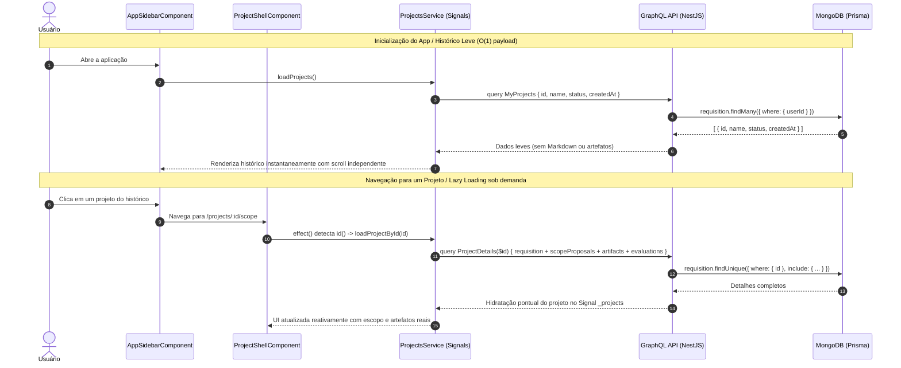

# Planejamento Reformulado: Correção HITL, Histórico Leve com Lazy Loading e Layout da Sidebar

## 🎯 Objetivo e Contexto

Reformular a estratégia de integração e hidratação de dados atendendo à diretriz de performance:
> **Diretriz:** A consulta de histórico (`myProjects`) **não deve** realizar hidratação completa de todos os artefatos e propostas de escopo de todas as requisições. O histórico precisa apenas dos metadados da `Requisition` (`id`, `name`, `status`, `createdAt`). A hidratação pesada (escopo em Markdown, múltiplos artefatos técnicos e avaliações do juiz) deve ocorrer exclusivamente **sob demanda (Lazy Loading)** quando o usuário navega para a página de um projeto específico.

Além disso, o plano contempla:
1. **Resolução da falha de HITL:** Correção do ID mismatch no aceite (`approveScopeProposal`) e rejeição (`rejectScopeProposal`) de propostas de escopo.
2. **Correção do Contrato de Download ZIP:** Ajuste do campo `base64` na query `downloadArtifactsZip`.
3. **Layout da Sidebar:** Scrollbar independente para a lista de histórico de projetos, mantendo a seção "Conhecimento" fixa e acessível imediatamente acima da seção de perfil/logout.

---

## 📊 Relatório Atualizado de Auditoria de Integração

| Operação / Recurso | Tipo | Status Anterior | Diagnóstico & Nova Estratégia |
| :--- | :--- | :--- | :--- |
| `myProjects` | GraphQL Query | 🟡 **Sobrecarga Evitada** | **Histórico Leve:** O backend `RequisitionRepository.findByUserId` permanece **sem** joins pesados (`include`), retornando apenas campos da tabela `Requisition`. A query no frontend passa a solicitar apenas `id`, `name`, `status` e `createdAt`. |
| `project(id)` | GraphQL Query | 🟢 **100% Funcional** | **Lazy Loading:** Utilizado para buscar sob demanda todos os detalhes (escopo, artefatos e avaliações) via `findByIdWithDetails`. Disparado reativamente no frontend assim que o usuário acessa ou alterna entre projetos. |
| `approveScopeProposal` / `rejectScopeProposal` | GraphQL Mutation | 🔴 **Quebrado (ID Mismatch)** | Frontend enviava o ID da requisição em vez do ID da proposta, resultando em 404. **Ação:** Fallback resiliente no repositório backend e envio preferencial de `proposal.id` no frontend. |
| `downloadArtifactsZip` | GraphQL Query | 🔴 **Quebrado (Field Mismatch)** | Frontend requisitava `base64Content`, mas o schema define `base64`. **Ação:** Alinhar frontend para `base64`. |
| **Sidebar Layout** | UI / CSS | 🔴 **Defeito de Layout** | Histórico e Conhecimento compartilhavam o scroll. **Ação:** Isolar rolagem no histórico com `flex-1 min-h-0 overflow-y-auto` e fixar Conhecimento como `shrink-0` acima do usuário. |
| `login`, `signup`, `me` | GraphQL Auth | 🟢 **100% Funcional** | Operando normalmente. |
| `createProject` | GraphQL Mutation | 🟢 **100% Funcional** | Operando normalmente. |
| `GET /api/events/stream` | REST (SSE) | 🟢 **100% Funcional** | Operando normalmente com Bearer Token e toasts semânticos. |

---

## 🏗️ Arquitetura da Solução

---

## 🛠️ Modificações Propostas

### 1. Backend: Resiliência no Repositório e Serviço de Escopo
- **`apps/api/src/modules/scope-proposals/scope-proposal.repository.ts`**:
  - Em `findById(id: string)`, buscar por `where: { id }`. Se não encontrar, realizar fallback buscando por `where: { requisitionId: id }, orderBy: { createdAt: 'desc' }`.
- **`apps/api/src/modules/scope-proposals/scope-proposal.service.ts`**:
  - Em `approve(id)` e `reject(id, feedback)`, usar `proposal.id` ao chamar `this.scopeProposalRepository.updateStatus(...)`, garantindo que atualize o documento correto no MongoDB mesmo quando acionado com `requisitionId`.

### 2. Frontend: Histórico Leve e Lazy Loading Reativo
- **`apps/web/src/app/core/models/types.ts`**:
  - Adicionar `id?: string` no objeto `scope` da interface `Project`.
- **`apps/web/src/app/core/services/projects.service.ts`**:
  - **`loadProjects()`**: Simplificar a query `MyProjects` para requisitar estritamente `id`, `name`, `status`, `createdAt`.
  - **`mapRequisitionToProject()`**: Mapear `id: latestScope?.id`.
  - **`approveScope()` e `rejectScope()`**: Enviar `project.scope?.id || projectId`.
  - **`downloadAllZip()`**: Substituir `base64Content` por `base64`.
- **`apps/web/src/app/features/project/shell/project-shell.component.ts`**:
  - Implementar `effect()` monitorando `this.id()`: sempre que o ID do projeto ativo mudar ou for inicializado, disparar `this.projectsService.loadProjectById(currentId)` sob demanda para obter os detalhes completos.
- **`apps/web/src/app/features/project/scope/project-scope.component.ts` & `project-artifacts.component.ts`**:
  - Simplificar ou remover guardas redundantes de `!this.project()`, delegando a carga ao shell do projeto ou carregando se `!p?.scope?.id`.

### 3. Frontend: Layout da Sidebar com Scrollbar Independente
- **`apps/web/src/app/shared/components/app-sidebar/app-sidebar.component.ts`**:
  - Dividir o corpo central da barra lateral:
    - Container flex: `flex-1 flex flex-col min-h-0 px-3 py-3 gap-3`.
    - Histórico: `flex-1 flex flex-col min-h-0 space-y-1.5`.
    - Lista com rolagem independente: `flex-1 overflow-y-auto min-h-0 pr-1 space-y-1 scrollbar-thin`.
    - Bloco "Conhecimento": `shrink-0 border-t border-sidebar-border pt-3`, fixo diretamente acima do rodapé do usuário/logout.

---

## 🧪 Plano de Verificação

1. **Compilação do Frontend:**
   - Executar `pnpm --filter @context-whisperer/web build` para validar ausência de erros de compilação TypeScript e templates Angular 21.
2. **Linter do Monorepo:**
   - Executar `pnpm run lint` garantindo tipagem estrita e ausência de violações de regras.
3. **Testes Unitários:**
   - Executar `pnpm test` (136 testes passando no backend e worker).
4. **Verificação de Comportamento:**
   - Verificar que a query `myProjects` é leve e carrega todos os projetos no histórico da barra lateral.
   - Navegar entre projetos no histórico e constatar que a carga sob demanda (`project(id)`) hidrata o escopo e artefatos de cada um.
   - Testar aceite e rejeição de escopo garantindo status 200/GraphQL Success.
   - Testar o layout da sidebar garantindo que "Templates & Constraints" permaneça fixo acima do rodapé de logout.
