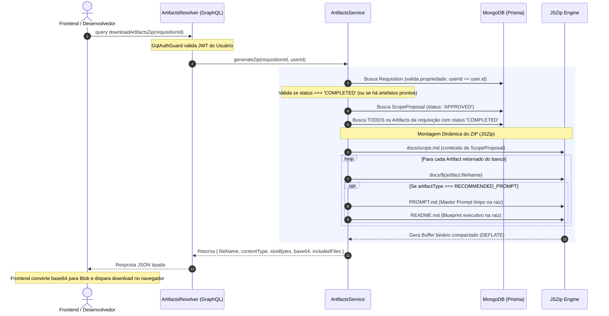

# Planejamento Arquitetural: Download Dinâmico dos Artefatos de Projeto em ZIP (100% GraphQL)

## 🎯 Descrição do Objetivo

Este documento formaliza a arquitetura e o design de engenharia para a funcionalidade de **Download Dinâmico dos Artefatos de Projeto em formato ZIP**, disponibilizada via **GraphQL Query**.

O objetivo central é permitir que o desenvolvedor obtenha todos os artefatos técnicos produzidos pelo Context-Whisperer compactados em um único arquivo `.zip`, com organização de pastas concebida especificamente para execução autônoma em ferramentas de AI Coding (Cursor Agent mode, Windsurf Cascade, Claude Code):

```text
spec-[requisitionId].zip
├── docs/                     # 📂 Catálogo DINÂMICO de TODOS os artefatos gerados para a requisição
│   ├── scope.md              # Contexto Executivo & Fronteiras MoSCoW (de ScopeProposal APPROVED)
│   ├── requirements.md       # Fonte Primária da Verdade Técnica (de Artifact REQUIREMENTS)
│   ├── recommended_mvp_prompt.md # Blueprint completo gerado (de Artifact RECOMMENDED_PROMPT)
│   └── [futuros_artefatos]   # docs/${artifact.fileName} (ex: architecture.md, openapi.yaml, etc.)
├── PROMPT.md                 # 🚀 Master Prompt com Protocolo de Loop Engineering na raiz
└── README.md                 # 📖 Blueprint Executivo com Stack, Roadmap e Instruções de Uso na raiz
```

---

## 👥 Decisão Arquitetural: 100% GraphQL Query (Sem Rotas REST)

A funcionalidade foi desenhada para operar **100% via GraphQL**, sem criar endpoints ou controllers REST adicionais no Fastify.

### Justificativas Técnicas:
1. **Semântica Idempotente (`Query`):**
   - No padrão GraphQL, operações de leitura sem efeito colateral no banco de dados devem ser modeladas como `Query`. O empacotamento do ZIP apenas lê dados existentes (`Artifact` e `ScopeProposal`) e sintetiza o binário em memória.
2. **Coerência com o Backend:**
   - O backend do Context-Whisperer é estritamente GraphQL Code-First. Evita-se misturar paradigmas de rotas HTTP REST com resolvers GraphQL.
3. **Arquivos Markdown são Extremamente Leves (Zero Overhead de Base64):**
   - Os artefatos são documentos textuais em Markdown. O arquivo ZIP gerado tem entre **15 KB e 40 KB**.
   - A codificação em Base64 para esse volume leva menos de **1 milissegundo** e trafega no JSON GraphQL com impacto de banda absolutamente irrisório.
4. **Segurança e Sessão Centralizadas:**
   - O frontend já se comunica enviando o token JWT via cabeçalho `Authorization: Bearer <token>`, reaproveitando nativamente o `GqlAuthGuard` e o decorator `@CurrentUser()`.

---

## ⚠️ PONTO DE ATENÇÃO CRÍTICO: Extensibilidade para Novos Artefatos

> [!IMPORTANT]
> **DIRETRIZ MANDATÓRIA PARA A IMPLEMENTAÇÃO DE NOVOS AGENTES / ARTEFATOS:**
> 
> À medida que o Context-Whisperer evoluir e novos agentes especialistas forem adicionados ao workflow (ex: Agente de Arquitetura C4, Agente de Contratos OpenAPI/Swagger, Agente de Modelo Entidade-Relacionamento/Prisma Schema, Agente de User Stories):
> 
> 1. **Persistência Padronizada com `fileName` Obrigatório:**
>    - O novo nodo gerador no `apps/worker` DEVE obrigatoriamente persistir seu resultado na collection `Artifact` do MongoDB definindo:
>      * `artifactType`: O tipo correspondente do enum `ArtifactType` (ex: `ARCHITECTURE_DOC`, `API_SPEC`).
>      * `fileName`: Um nome de arquivo semântico e com a extensão correta (ex: `architecture.md`, `openapi.yaml`, `domain_model.puml`, `schema.sql`).
>      * `status`: Definido como `'COMPLETED'` após geração bem-sucedida.
>      * `generatedContent`: O conteúdo textual gerado.
> 
> 2. **Inclusão Dinâmica e Automática no ZIP:**
>    - O serviço [`ArtifactsService`](file:///C:/Users/joker/OneDrive/Documents/github/context-whisperer_backend/apps/api/src/modules/artifacts/artifacts.service.ts) **NÃO possui lista fixa ou hardcoded de arquivos**. Ele busca dinamicamente todos os registros na collection `Artifact` onde `requisitionId === id` e `status === 'COMPLETED'`.
>    - Qualquer novo artefato persistido será automaticamente inserido na pasta `docs/${artifact.fileName}` do arquivo ZIP gerado para o usuário, **sem que seja necessário alterar uma única linha do serviço de ZIP**.
> 
> 3. **Consistência Automática no Master Prompt:**
>    - O nodo [`recommendedPromptAgent`](file:///C:/Users/joker/OneDrive/Documents/github/context-whisperer_backend/apps/worker/src/workflows/agents/nodes/recommended-prompt-agent.node.ts) já foi construído para consultar dinamicamente a tabela `Artifact` no MongoDB e injetar automaticamente todos os arquivos disponíveis como `@docs/${art.fileName}` na seção *"ARQUIVOS DE ESPECIFICAÇÃO DISPONÍVEIS NO REPOSITÓRIO"*.
>    - Dessa forma, o agente autônomo (Cursor, Windsurf, Claude Code) sempre saberá da existência de qualquer novo arquivo incluído na pasta `docs/`.

---

## 🔍 Fluxo de Execução da Query GraphQL



---

## 📐 Especificação Técnica da API

### 1. GraphQL Type: `ArtifactsZipModel`
```typescript
@ObjectType({ description: 'Payload contendo os metadados e o binário em Base64 do pacote ZIP de artefatos' })
export class ArtifactsZipModel {
  @Field(() => String, { description: 'Nome sugerido do arquivo ZIP (ex: spec-projeto-telemedicina.zip)' })
  fileName!: string;

  @Field(() => String, { description: 'Tipo MIME do arquivo (application/zip)' })
  contentType!: string;

  @Field(() => Int, { description: 'Tamanho total do arquivo ZIP gerado em bytes' })
  sizeBytes!: number;

  @Field(() => String, { description: 'Conteúdo binário do arquivo compactado codificado em Base64' })
  base64!: string;

  @Field(() => [String], { description: 'Lista completa de caminhos dos arquivos incluídos dentro do ZIP' })
  includedFiles!: string[];
}
```

### 2. GraphQL Query: `downloadArtifactsZip`
```graphql
query DownloadArtifactsZip($requisitionId: ID!) {
  downloadArtifactsZip(requisitionId: $requisitionId) {
    fileName
    contentType
    sizeBytes
    base64
    includedFiles
  }
}
```

### 3. Exemplo de Consumo no Frontend (TypeScript / React)
```typescript
async function handleDownloadZip(requisitionId: string) {
  const { data } = await apolloClient.query({
    query: DOWNLOAD_ARTIFACTS_ZIP_QUERY,
    variables: { requisitionId },
  });

  const { base64, fileName } = data.downloadArtifactsZip;
  
  // Conversão instantânea de Base64 para Blob nativo
  const binaryString = window.atob(base64);
  const bytes = new Uint8Array(binaryString.length);
  for (let i = 0; i < binaryString.length; i++) {
    bytes[i] = binaryString.charCodeAt(i);
  }
  
  const blob = new Blob([bytes], { type: 'application/zip' });
  const url = window.URL.createObjectURL(blob);
  const link = document.createElement('a');
  link.href = url;
  link.download = fileName;
  document.body.appendChild(link);
  link.click();
  document.body.removeChild(link);
  window.URL.revokeObjectURL(url);
}
```

---

## 🛡️ Regras de Negócio e Validações de Segurança

1. **Autenticação:** Rota protegida por `GqlAuthGuard` (JWT obrigatório).
2. **Controle de Acesso / Autorização:**
   - O `userId` autenticado deve ser o proprietário da `Requisition` (`requisition.userId === user.id`).
   - Usuários com perfil `admin` têm permissão de acesso a qualquer requisição.
   - Caso o usuário tente acessar uma requisição alheia, retorna `ForbiddenException('Você não tem permissão para acessar os artefatos desta requisição.')`.
3. **Validação de Existência:**
   - Se a requisição não existir no banco de dados, retorna `NotFoundException('Requisição não encontrada.')`.
4. **Validação de Ciclo de Vida / Conclusão:**
   - Se a requisição estiver em processamento (`GENERATING`, `AWAITING_SCOPE`, `GENERATING_ARTIFACTS`) e não possuir artefatos concluídos, retorna `BadRequestException('Os artefatos desta requisição ainda estão sendo gerados. Aguarde a conclusão.')`.

---

## 📦 Estrutura de Arquivos a Serem Criados na API

```text
apps/api/src/modules/artifacts/
├── dto/
│   └── artifacts-zip.model.ts    # ObjectType GraphQL com fileName, base64, etc.
├── artifacts.service.ts          # Regra de negócio, busca no Prisma e JSZip
├── artifacts.resolver.ts         # Query GraphQL com GqlAuthGuard
└── artifacts.module.ts           # Registro do módulo no NestJS
```

---

## 🧪 Estratégia de Testes Automatizados

1. **Testes Unitários do Serviço (`artifacts.service.spec.ts`):**
   - Rejeição com 404 para requisição inexistente.
   - Rejeição com 403 para usuário não autorizado.
   - Rejeição com 400 para requisição em andamento / sem artefatos.
   - Validação de geração de ZIP dinâmico: mockar 4 artefatos com tipos e nomes distintos (`requirements.md`, `scope.md`, `recommended_mvp_prompt.md`, `architecture.md`) e validar com `JSZip.loadAsync` se todos os arquivos estão nos caminhos corretos e com conteúdos íntegros.
   - Validação de extração correta de `PROMPT.md` e `README.md` a partir de `RECOMMENDED_PROMPT`.
2. **Testes Unitários do Resolver (`artifacts.resolver.spec.ts`):**
   - Validação de injeção de dependência e delegação para o serviço.
3. **Verificação Geral do Monorepo:**
   - `pnpm test`
   - `pnpm run test:integration`
   - `pnpm run lint`
   - `pnpm run build`
