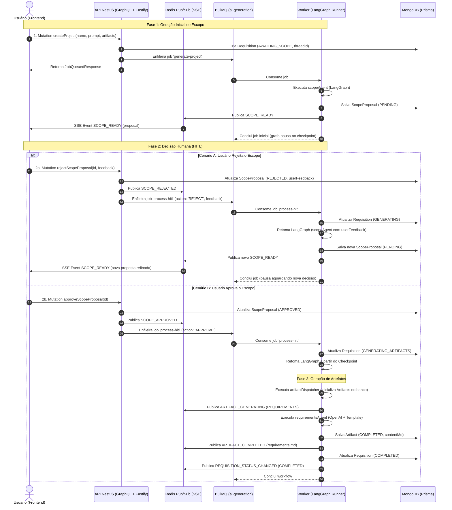
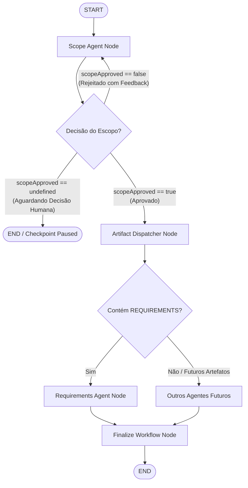

# Planejamento: Human-in-the-Loop (Aprovação/Recusa de Escopo) e Geração Paralela de Artefatos

Este documento detalha o planejamento arquitetural e operacional para a implementação do ciclo **Human-in-the-Loop (HITL)** para aprovação ou refutação de escopo, refinamento iterativo orientado a feedback, e disparo automatizado da geração de artefatos em paralelo (`ArtifactType[]`), iniciando com o agente piloto de **Requisitos** (`RequirementsAgent`).

---

## 1. Contexto e Objetivos

1. **Ciclo Human-in-the-Loop (HITL):**
   - O usuário recebe a notificação SSE `SCOPE_READY` com a proposta de escopo gerada.
   - **Se o usuário rejeitar (`rejectScopeProposal`):** Envia um feedback textual (ex: *"Quero remover autenticação social e adicionar suporte a pagamentos PIX"*). O workflow reinicia o agente de escopo, enriquecendo o prompt com o histórico anterior e o feedback, gerando uma nova proposta (`ScopeProposal`) no banco e notificando novamente via SSE (`SCOPE_READY`).
   - **Se o usuário aprovar (`approveScopeProposal`):** O workflow avança para a fase de produção técnica de artefatos.
2. **Geração de Artefatos em Paralelo:**
   - O projeto possui em seu contrato os artefatos solicitados pelo usuário (`CreateProjectInput.artifacts: ArtifactType[]`).
   - Nesta etapa, implementaremos o primeiro nó especialista: **`RequirementsAgent`** (Engenharia de Requisitos), mantendo a arquitetura pronta para fan-out paralelo com `ArchitectureAgent`, `UmlAgent`, etc.
3. **Definição Arquitetural do Nodo Intermediário:**
   - Avaliar a necessidade de um nodo intermediário (`artifactDispatcher` / `artifactOrchestrator`) antes dos agentes especialistas.

---

## 2. Análise Técnica: É Necessário um Nodo Intermediário?

> [!TIP]
> **Resposta:** **Sim, um nodo intermediário (`artifactDispatcher`) é altamente recomendado.**

### Comparativo Arquitetural:

| Critério | Sem Nodo Intermediário (Bifurcação Direta) | Com Nodo Intermediário (`artifactDispatcher`) [Recomendado] |
| :--- | :--- | :--- |
| **Persistência Prévia no Banco** | Cada agente especialista precisaria criar seu próprio registro `Artifact` no MongoDB, gerando concorrência ou código duplicado. | O `artifactDispatcher` cria previamente todos os registros `Artifact` solicitados com status `GENERATING` em uma única operação atômica. |
| **Notificações SSE ao Frontend** | Cada agente emite seu início isoladamente. Se houver 3 artefatos, o frontend recebe eventos dispersos sem pré-conhecimento da lista. | O `artifactDispatcher` emite de imediato os eventos `ARTIFACT_GENERATING` para cada artefato planejado, permitindo que a UI renderize todos os cards em estado *loading*. |
| **Preparação e Cache de Contexto** | Cada agente especialista precisaria buscar o `ScopeProposal` aprovado do MongoDB por conta própria. | O `artifactDispatcher` carrega o escopo aprovado do banco uma única vez e injeta no estado compartilhado do LangGraph (`approvedScopeContent`). |
| **Status da Requisição** | Indefinição de quem atualiza a `Requisition` para `GENERATING_ARTIFACTS`. | O dispatcher centraliza a transição de status da `Requisition`. |
| **Escalabilidade (Fan-out Dinâmico)** | A lógica de decidir quais agentes rodar fica embutida em uma conditional edge acoplada ao escopo. | O dispatcher atua como roteador limpo: avalia `state.projectRequest.artifacts` e despacha em paralelo via LangGraph Fan-out (`Send` API ou routing dinâmico). |

---

## 3. Arquitetura da Solução e Fluxo de Execução

### 🧭 Diagrama de Sequência: Ciclo E2E com Human-in-the-Loop



---

## 4. Topologia do Grafo LangGraph



### Detalhes dos Nós:
1. **`scopeAgent`:**
   - Se `state.userFeedback` estiver presente: injeta a proposta anterior e o feedback no prompt do modelo para orientar a revisão.
   - Gera o escopo estruturado via MoSCoW (`ProposedScopeSchema`).
   - Formata via template `default_scope_response`.
   - Persiste nova `ScopeProposal` (PENDING) no banco.
   - Emite evento `SCOPE_READY` via SSE/Redis.
   - Define `scopeApproved: undefined` para interromper o ciclo até o input humano.
2. **`scopeDecision` (Conditional Edge):**
   - Se `scopeApproved === true` ➔ Segue para `artifactDispatcher`.
   - Se `scopeApproved === false` ➔ Retorna para `scopeAgent` (loop de feedback).
   - Se `scopeApproved === undefined` ➔ Encerra a execução atual no checkpoint do MongoDB.
3. **`artifactDispatcher`:**
   - Recupera o conteúdo da proposta aprovada e grava em `state.approvedScopeContent`.
   - Identifica os artefatos em `state.projectRequest.artifacts`.
   - Cria os registros na collection `Artifact` (status `GENERATING`).
   - Dispara eventos SSE `ARTIFACT_GENERATING` para cada artefato.
   - Encaminha para os nós especialistas correspondentes.
4. **`requirementsAgent`:**
   - Utiliza os templates `default_requirements` e `default_requirements_response` cadastrados no banco.
   - Gera a especificação técnica de requisitos estruturada (RF-xx, RNF-xx, RN-xx).
   - Persiste o conteúdo gerado no registro `Artifact` com status `COMPLETED`.
   - Dispara evento SSE `ARTIFACT_COMPLETED`.
5. **`finalizeWorkflow`:**
   - Marca a requisição como `COMPLETED` no MongoDB.
   - Dispara evento SSE `REQUISITION_STATUS_CHANGED` (`COMPLETED`).

---

## 5. Estratégia de Retomada do LangGraph: Alternativas Avaliadas

### 📍 Alternativa 1: BullMQ Job de Retomada (`process-hitl`) [Recomendada]
- **Como funciona:**
  - O job inicial `generate-project` executa `scopeAgent`, salva o checkpoint no MongoDB pelo `MongoDBSaver` usando o `threadId`, e finaliza com sucesso.
  - O worker é liberado imediatamente para atender outros jobs (sem threads suspensas ou travadas em memória).
  - Quando o usuário aprova ou rejeita via GraphQL, a API adiciona o job `process-hitl` na fila com `{ requisitionId, threadId, action, feedback }`.
  - O worker consome o job, atualiza o estado no checkpointer com `graph.updateState({ configurable: { thread_id: threadId } }, { scopeApproved, userFeedback })` e chama `graph.invoke(null, config)`.
- **Vantagens:**
  - 100% resiliente a reinicializações de servidor: o estado está seguro no MongoDB.
  - Zero desperdício de concorrência no BullMQ enquanto o usuário pensa/revisa (o que pode levar minutos ou dias).
  - Totalmente desacoplado e aderente ao padrão assíncrono do projeto.

### 📍 Alternativa 2: LangGraph `interrupt()` com Job BullMQ de Longa Duração
- **Como funciona:**
  - O nó de escopo chama `interrupt()` nativo do LangGraph e o job BullMQ aguarda ativamente.
- **Desvantagens:**
  - Desperdiça workers ativos no BullMQ mantendo o job em `active` ou exige tratamento complexo de retries de fila.
  - Se o container do worker reiniciar durante a espera humana, o job é considerado `stalled` pelo BullMQ.

---

## 6. Alterações Necessárias por Módulo

### 🗄️ 1. Banco de Dados (`packages/database`)
- **`prisma/schema.prisma`:**
  Adicionar o campo `threadId String?` no model `Requisition`:
  ```prisma
  model Requisition {
    id             String          @id @default(auto()) @map("_id") @db.ObjectId
    userId         String          @db.ObjectId
    user           User            @relation(fields: [userId], references: [id])
    originalPrompt String
    status         String          @default("AWAITING_SCOPE")
    threadId       String?         // ID da thread de execução do LangGraph
    ...
  }
  ```
  Executar `pnpm run db:push` para atualizar o MongoDB.

- **`prisma/seed.js`:**
  Adicionar templates para o agente de requisitos:
  - `default_requirements`: Prompt do Engenheiro de Requisitos Sênior orientando a extração de Requisitos Funcionais, Não-Funcionais e Regras de Negócio a partir do escopo aprovado.
  - `default_requirements_response`: Template Markdown com marcadores `{{functionalRequirements}}`, `{{nonFunctionalRequirements}}`, `{{businessRules}}`.
  Executar `pnpm run db:seed`.

### 📦 2. Pacote Compartilhado (`packages/core`)
- **`packages/core/src/agents/langgraph/state.ts`:**
  Enriquecer o `GraphState`:
  ```typescript
  export interface GraphStateType {
    projectRequest: CreateProjectInput;
    requisitionId: string;
    userId: string;
    scopeProposalId: string;
    messages: BaseMessage[];
    // Novos campos HITL:
    scopeApproved?: boolean;
    userFeedback?: string;
    approvedScopeContent?: string;
    artifactsToGenerate?: ArtifactType[];
  }
  ```
- **`packages/core/src/agents/langgraph/schemas/requirements.schema.ts`:**
  Definir o schema Zod para structured output de requisitos:
  ```typescript
  export const RequirementsSchema = z.object({
    summary: z.string(),
    functionalRequirements: z.array(z.object({
      id: z.string(),
      title: z.string(),
      description: z.string(),
      priority: z.enum(['HIGH', 'MEDIUM', 'LOW']),
    })),
    nonFunctionalRequirements: z.array(z.object({
      id: z.string(),
      category: z.string(),
      description: z.string(),
    })),
    businessRules: z.array(z.object({
      id: z.string(),
      description: z.string(),
    })),
  });
  ```

### 🌐 3. API (`apps/api`)
- **`requisitions.service.ts`:**
  Permitir salvar e consultar `threadId` na criação da requisição.
- **`agents.service.ts`:**
  Passar o `threadId` gerado para o método `requisitionService.create(userId, prompt, threadId)`.
- **`scope-proposal.resolver.ts`:**
  Injetar a fila BullMQ `@InjectQueue('ai-generation') private readonly queue: Queue`:
  - Em `approveScopeProposal(id)`:
    - Recupera a requisição e seu `threadId`.
    - Atualiza a proposta para `APPROVED`.
    - Emite SSE `SCOPE_APPROVED`.
    - Enfileira no BullMQ: `await this.queue.add('process-hitl', { requisitionId, threadId, action: 'APPROVE', userId })`.
  - Em `rejectScopeProposal(id, feedback)`:
    - Recupera a requisição e seu `threadId`.
    - Atualiza a proposta para `REJECTED` com `userFeedback`.
    - Emite SSE `SCOPE_REJECTED`.
    - Enfileira no BullMQ: `await this.queue.add('process-hitl', { requisitionId, threadId, action: 'REJECT', feedback, userId })`.

### ⚙️ 4. Worker (`apps/worker`)
- **`generation.processor.ts`:**
  Expandir para processar tanto jobs de `generate-project` quanto `process-hitl`:
  - Se job for `process-hitl`:
    - Atualiza o checkpointer do LangGraph:
      ```typescript
      await graph.updateState(
        { configurable: { thread_id: threadId } },
        action === 'APPROVE'
          ? { scopeApproved: true }
          : { scopeApproved: false, userFeedback: feedback }
      );
      ```
    - Invoca a continuação do grafo:
      ```typescript
      await graph.invoke(null, {
        configurable: { thread_id: threadId, redis: redisPublisher },
      });
      ```
- **`scope-agent.node.ts`:**
  Refatorar para verificar se `state.userFeedback` existe. Caso positivo, compor prompt de refinamento contextual com o histórico.
- **`artifact-dispatcher.node.ts` (Novo):**
  - Implementar o nó intermediário.
  - Criar os registros em `Artifact` no MongoDB.
  - Publicar `ARTIFACT_GENERATING` no Redis.
- **`requirements-agent.node.ts` (Novo):**
  - Buscar templates no MongoDB.
  - Invocar OpenAI via `withStructuredOutput(RequirementsSchema)`.
  - Salvar artefato gerado no MongoDB como `COMPLETED`.
  - Publicar `ARTIFACT_COMPLETED` no Redis.
- **`graph.ts`:**
  Configurar a nova topologia com as conditional edges e os novos nós.

---

## 7. Roteiro de Implementação em Fases

### 📌 Fase 1: Schema Prisma e Seeds de Requisitos
- [x] Adicionar `threadId String?` no model `Requisition` em `packages/database/prisma/schema.prisma`.
- [x] Executar `pnpm run db:generate` (atualizando tipos tipados do Prisma Client).
- [x] Adicionar templates `default_requirements` e `default_requirements_response` no `packages/database/prisma/seed.js`.
- [x] Executar compilação do pacote database (`pnpm --filter @context-whisperer/database build`).

### 📌 Fase 2: Schemas e Tipos no Core (`packages/core`)
- [x] Criar `requirements.schema.ts` com o schema Zod e tipos inferidos.
- [x] Atualizar `GraphState` com os novos campos de HITL (`scopeApproved`, `userFeedback`, `approvedScopeContent`, `generatedArtifactIds`).
- [x] Exportar runtime e tipos em `index.ts` e compilar o core (`pnpm --filter @context-whisperer/core build`).

### 📌 Fase 3: Integração API ➔ BullMQ para Resunção de Workflow
- [x] Atualizar `RequisitionRepository` e `RequisitionsService` para persistir o `threadId`.
- [x] Atualizar `AgentsService.executeWorkflow` para persistir o `threadId` na criação da requisição.
- [x] Injetar a fila `ai-generation` no `ScopeProposalResolver`.
- [x] Enfileirar o job `process-hitl` em `approveScopeProposal` e `rejectScopeProposal`.

### 📌 Fase 4: Nós do Worker e Orquestração do Grafo (`apps/worker`)
- [x] Atualizar `scopeAgent` para tratar loop de refinamento quando houver `userFeedback`.
- [x] Criar o nó intermediário `artifactDispatcher` (`apps/worker/src/workflows/agents/nodes/artifact-dispatcher.node.ts`).
- [x] Criar o nó especialista de requisitos `requirementsAgent` (`apps/worker/src/workflows/agents/nodes/requirements-agent.node.ts`).
- [x] Atualizar `graph.ts` com conditional edges e suporte a checkpoints.
- [x] Atualizar `generation.processor.ts` para processar as ações `APPROVE` e `REJECT` de retomada via `process-hitl`.

### 📌 Fase 5: Testes e Validação Completa
- [x] Testes unitários para `scopeAgent` (caso inicial e caso de refinamento com feedback).
- [x] Testes unitários para `artifactDispatcher` e `requirementsAgent`.
- [x] Testes unitários para `ScopeProposalResolver` validando o enfileiramento no BullMQ.
- [x] Teste de integração assíncrono do Worker validando todo o ciclo HITL:
  1. Criação e geração do escopo inicial (`SCOPE_READY`).
  2. Rejeição com feedback e regeneração de escopo refinado (`SCOPE_REJECTED` ➔ `SCOPE_READY`).
  3. Aprovação do escopo e disparo de artefato (`SCOPE_APPROVED` ➔ `ARTIFACT_GENERATING` ➔ `ARTIFACT_COMPLETED`).
- [x] Validação estrita de lint (`pnpm -r lint`): 0 erros, 0 warnings.
- [x] Validação estrita de build (`pnpm -r build`): 100% dos pacotes compilados com sucesso.
- [x] Bateria de testes automatizados (`pnpm test`): 97 testes unitários + testes de integração passando 100%.
