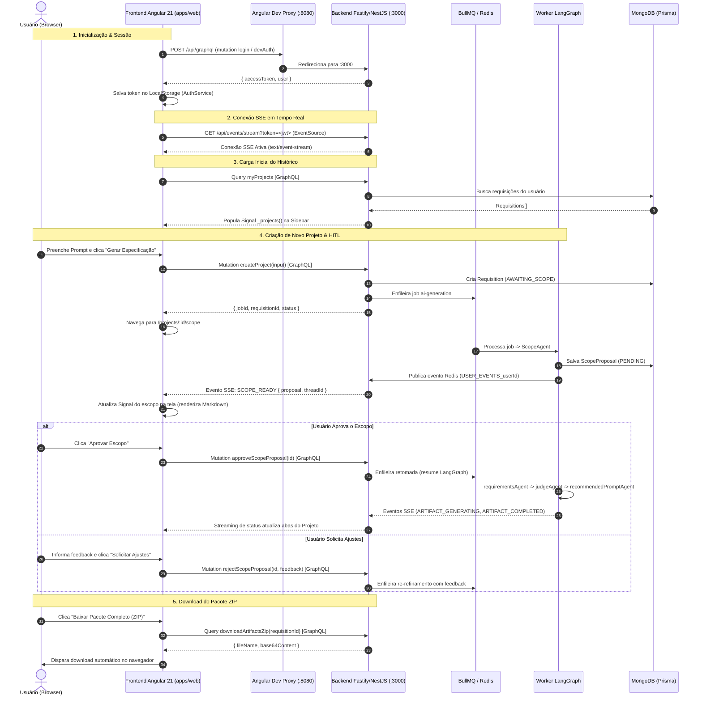

# 📋 Planejamento de Engenharia: Integração Frontend ↔ Backend (GraphQL + SSE)

> **Status:** Concluído / Implementado  
> **Fase:** Fase 3 — Integração Real Frontend ↔ Backend  
> **Escopo:** Conectar a SPA Angular 21 (`apps/web`) à API Fastify/NestJS (`apps/api`), substituindo os dados mockados por GraphQL Queries/Mutations reais, reconexão de streaming em tempo real via Server-Sent Events (SSE) e download dinâmico de ZIP de artefatos.

---

## 🎯 1. Visão Geral e Objetivos

Com o frontend modernizado em **Angular 21 (LTS)** utilizando Standalone Components, reatividade nativa via Signals e compilação otimizada com Tailwind CSS v4, o próximo passo da evolução do sistema é **eliminar a camada de dados simulados (mock data)** e estabelecer a comunicação bidirecional com o backend:

1. **Persistência e Histórico Real:** Projetos criados persistem no MongoDB e são carregados na barra lateral a partir do banco.
2. **Ciclo Human-in-the-Loop (HITL) Conectado:** O formulário de Novo Projeto despacha a criação para o BullMQ/LangGraph; a proposta gerada pelo `scopeAgent` chega em tempo real na tela via SSE para aprovação ou recusa com feedback.
3. **Acompanhamento Visual da Orquestração:** Transições de estado dos agentes especialistas (`requirementsAgent`, `judgeAgent`, `recommendedPromptAgent`) refletem dinamicamente no grafo e nas abas de avaliação e artefatos.
4. **Entrega de Artefatos & Download ZIP:** Download dos arquivos Markdown e do pacote compactado gerado sob demanda pelo backend (`downloadArtifactsZip`).

---

## 🗺️ 2. Arquitetura da Integração



---

## 🔍 3. Diagnóstico de Gaps & Contratos de Dados

### 3.1. Gaps Identificados no Backend (`apps/api`)
Atualmente, o backend possui os resolvers de autenticação, mutações de fluxo (`createProject`, `approveScopeProposal`, `rejectScopeProposal`) e download ZIP (`downloadArtifactsZip`). Porém, **faltam queries essenciais de leitura**:

1. **`myProjects: [RequisitionModel!]!`**: Permite à barra lateral listar o histórico de projetos reais do usuário autenticado.
2. **`project(id: ID!): RequisitionModel`**: Permite à rota `/projects/:id` (e suas sub-rotas) carregar os dados completos do projeto, propostas de escopo e lista de artefatos mesmo após recarregar o navegador (*F5*).
3. **Modelos GraphQL Faltantes:**
   - `ArtifactModel` (decorado com `@ObjectType()` e `@Field()`).
   - `ArtifactEvaluationModel` (expondo as avaliações do Juiz Causal para a aba Juiz).
   - Relacionamentos `@Field(() => [ArtifactModel])` e `@Field(() => [ScopeProposalModel])` em `RequisitionModel`.

### 3.2. Gaps Identificados no Frontend (`apps/web`)
1. **Proxy de Desenvolvimento:** Não há `proxy.conf.json` configurado no Angular CLI, o que causa erro de CORS e porta cruzada (`localhost:8080` ➔ `localhost:3000`).
2. **Serviço de Autenticação (`AuthService`):** Ausência de armazenamento do JWT e controle de sessão do usuário.
3. **Cliente GraphQL (`GraphQLService`):** O frontend não possui cliente HTTP para executar Queries e Mutations tipadas.
4. **Serviço SSE (`SseService`):** Ausência de escuta da stream `GET /api/events/stream?token=...`.
5. **Acoplamento a Mocks:** `ProjectsService` manipula arrays estáticos em memória em vez de delegar para a API.

---

## 🛠️ 4. Especificação Técnica da Solução

### Etapa 1: Expansão do Schema GraphQL no Backend (`apps/api`)

#### 1.1. Modelos GraphQL (`ArtifactModel` e `ArtifactEvaluationModel`)
Criar os ObjectTypes necessários para retornar artefatos e avaliações:

```typescript
// apps/api/src/modules/artifacts/artifact.model.ts
@ObjectType()
export class ArtifactModel {
  @Field(() => ID)
  id!: string;

  @Field()
  requisitionId!: string;

  @Field()
  artifactType!: string;

  @Field()
  fileName!: string;

  @Field({ nullable: true })
  generatedContent?: string;

  @Field()
  status!: string;

  @Field(() => Int)
  iterationCount!: number;

  @Field()
  createdAt!: Date;

  @Field()
  updatedAt!: Date;
}
```

```typescript
// apps/api/src/modules/artifacts/artifact-evaluation.model.ts
@ObjectType()
export class ArtifactEvaluationModel {
  @Field(() => ID)
  id!: string;

  @Field()
  artifactId!: string;

  @Field()
  requisitionId!: string;

  @Field(() => Int)
  iteration!: number;

  @Field()
  status!: string; // PASSED | FAILED

  @Field(() => Float)
  score!: number;

  @Field()
  summary!: string;

  @Field(() => [String])
  rootCauses!: string[];

  @Field({ nullable: true })
  counterfactualFeedback?: string;

  @Field()
  createdAt!: Date;
}
```

#### 1.2. Atualização do `RequisitionModel`
Adicionar os campos de relação que enriquecem o projeto:
```typescript
@Field(() => [ScopeProposalModel], { nullable: true })
scopeProposals?: ScopeProposalModel[];

@Field(() => [ArtifactModel], { nullable: true })
artifacts?: ArtifactModel[];

@Field(() => [ArtifactEvaluationModel], { nullable: true })
evaluations?: ArtifactEvaluationModel[];
```

#### 1.3. Criação do `RequisitionsResolver` e Métodos no Repositório
No `RequisitionRepository`:
- `findByUserId(userId: string): Promise<Requisition[]>`
- `findByIdWithDetails(id: string): Promise<Requisition | null>` (com `include: { scopeProposals: true, artifacts: true, evaluations: true }`)

No `RequisitionsResolver`:
```typescript
@Resolver(() => RequisitionModel)
@UseGuards(GqlAuthGuard)
export class RequisitionsResolver {
  constructor(private readonly requisitionsService: RequisitionsService) {}

  @Query(() => [RequisitionModel], { name: 'myProjects' })
  async getMyProjects(@CurrentUser() user: UserModel): Promise<RequisitionModel[]> {
    return this.requisitionsService.findByUserId(user.id);
  }

  @Query(() => RequisitionModel, { name: 'project' })
  async getProject(
    @Args('id', { type: () => ID }) id: string,
    @CurrentUser() user: UserModel,
  ): Promise<RequisitionModel> {
    return this.requisitionsService.findByIdWithDetails(id, user.id);
  }
}
```

---

### Etapa 2: Configuração de Proxy no Angular CLI (`apps/web`)

Criar `apps/web/proxy.conf.json`:
```json
{
  "/api": {
    "target": "http://localhost:3000",
    "secure": false,
    "changeOrigin": true,
    "logLevel": "debug"
  }
}
```

Configurar no `apps/web/angular.json`:
```json
"serve": {
  "builder": "@angular/build:dev-server",
  "configurations": {
    "development": {
      "buildTarget": "web:build:development",
      "proxyConfig": "proxy.conf.json"
    }
  }
}
```

---

### Etapa 3: Serviços de Infraestrutura no Frontend (`apps/web`)

#### 3.1. `AuthService` (Signals-First)
- Gerencia o JWT em `localStorage`.
- Mantém o Signal `currentUser` e `token`.
- Provê método de auto-login / guest login em desenvolvimento: caso o token não exista, executa um login transparente com um usuário seeded de desenvolvimento (`dev@context-whisperer.local`), garantindo experiência fluida sem bloqueios no frontend.

#### 3.2. `GraphQLService` (Signals-First & Zero RxJS)
- Cliente GraphQL leve baseado na API nativa `fetch` ou `HttpClient`.
- Injeta o cabeçalho `Authorization: Bearer ${token}`.
- Trata erros de GraphQL (`errors[0].message`) e erros de rede de forma unificada.

#### 3.3. `SseService` (Conexão e Notificações em Tempo Real)
- Cria uma instância de `EventSource('/api/events/stream?token=' + token)`.
- Gerencia ciclo de vida e reconexão automática.
- Dispara callbacks e eventos reativos baseados nos tipos do `@context-whisperer/core`:
  - `SCOPE_READY`
  - `SCOPE_APPROVED`
  - `SCOPE_REJECTED`
  - `ARTIFACT_GENERATING`
  - `ARTIFACT_COMPLETED`
  - `WORKFLOW_FAILED`

---

### Etapa 4: Refatoração do `ProjectsService` no Frontend

O serviço central passará a trabalhar de forma assíncrona, sincronizando as respostas da API com o estado reativo dos Signals:

```typescript
@Injectable({ providedIn: "root" })
export class ProjectsService {
  private readonly _projects = signal<Project[]>([]);
  private readonly _currentProject = signal<Project | null>(null);
  private readonly _loading = signal<boolean>(false);

  readonly projects = this._projects.asReadonly();
  readonly currentProject = this._currentProject.asReadonly();
  readonly loading = this._loading.asReadonly();

  // 1. Carrega projetos reais do backend
  async loadProjects(): Promise<void>;

  // 2. Carrega um projeto específico por ID (com escopo e artefatos)
  async loadProjectById(id: string): Promise<Project | null>;

  // 3. Criação de projeto via Mutation GraphQL createProject
  async createProject(input: CreateProjectInput): Promise<string>;

  // 4. Aprovação de Escopo via Mutation approveScopeProposal
  async approveScope(proposalId: string): Promise<void>;

  // 5. Recusa de Escopo via Mutation rejectScopeProposal
  async rejectScope(proposalId: string, feedback: string): Promise<void>;

  // 6. Download de ZIP via Query downloadArtifactsZip
  async downloadArtifactsZip(requisitionId: string): Promise<void>;
}
```

---

## 🧪 5. Plano de Validação e Testes

| Teste | Escopo | Critério de Sucesso |
| :--- | :--- | :--- |
| **Testes Unitários do Backend** | `apps/api` | Criação de testes unitários para `RequisitionsResolver` e novos métodos do repository. Todos os 137+ testes devem passar. |
| **Proxy de API** | `apps/web` ➔ `apps/api` | Requisições para `http://localhost:8080/api/graphql` devem atingir o NestJS na porta 3000 sem erro de CORS. |
| **Fluxo Completo HITL** | End-to-End | Criar projeto pela interface web ➔ verificar enfileiramento ➔ proposta de escopo renderizada via SSE ➔ aprovação na UI ➔ visualização de artefatos e download do ZIP. |
| **Zero Quebra de Build** | Monorepo | `pnpm run build` e `pnpm run lint` devem permanecer com 0 erros. |

---

## 🚦 6. Sequência de Execução Recomendada

1. **Fase 3.1 — Backend:** Implementar `ArtifactModel`, `ArtifactEvaluationModel`, atualizar `RequisitionModel`, criar `RequisitionRepository.findByUserId` / `findByIdWithDetails` e `RequisitionsResolver` com testes unitários.
2. **Fase 3.2 — Infra Frontend:** Criar `proxy.conf.json`, `AuthService`, `GraphQLService` e `SseService` em `apps/web`.
3. **Fase 3.3 — Integração de Negócio:** Conectar `ProjectsService` às queries/mutations reais e ao stream SSE.
4. **Fase 3.4 — Validação E2E:** Testar o ciclo completo de criação, aprovação de escopo e download de artefatos.
