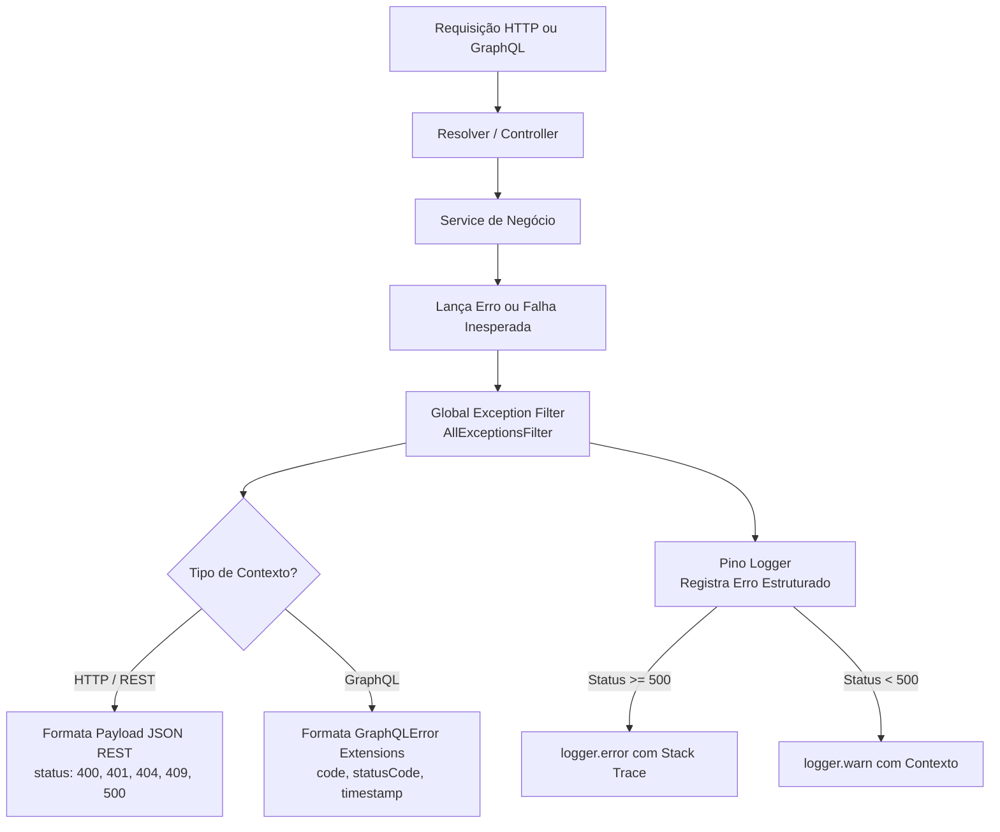

# Planejamento: Middleware e Filtro Global de Tratamento de Erros da API

Este documento estabelece o planejamento para a implementação do sistema centralizado de captura e tratamento de erros da API do **Context-Whisperer**, adotando a abordagem **"Fail-Fast / Let it Throw"**, padronização estrita em **inglês**, mapeamento de exceções específicas de domínio e fallback universal para **HTTP 500 (Internal Server Error)**.

---

## 1. Filosofia: "Fail-Fast / Let it Throw"

### 🎯 Diretrizes:
1. **Sem `try/catch` defensivos desnecessários:**
   - Services e Resolvers não devem encapsular chamadas de banco ou regras de negócio em blocos `try/catch` para silenciar ou re-lançar erros genéricos.
   - Se uma validação falhar ou uma entidade não for encontrada, o serviço lança a exceção diretamente (`throw new EntityNotFoundException(...)`) ou deixa o erro subir livremente.
2. **Centralização no Middleware / Exception Filter:**
   - O tratamento, formatação de resposta ao cliente, mascaramento de dados sensíveis e logging via Pino acontecem exclusivamente na borda (Global Exception Filter).
3. **Erros Sempre em Inglês:**
   - Todas as mensagens de erro retornadas ao cliente e registradas nos logs devem ser em inglês (ex: `"Invalid email or password"`, `"User with this email already exists"`).

---

## 2. Arquitetura da Solução

No NestJS com plataforma Fastify e Mercurius (GraphQL), o tratamento de erros precisa atender perfeitamente a **dois contextos de transporte**:
1. **Contexto HTTP / REST:** Endpoints REST (como `/api/events/stream` de SSE e healthchecks).
2. **Contexto GraphQL:** Queries e Mutations em `/api/graphql` gerenciadas pelo Mercurius.



### Componentes Principais:
1. **`AllExceptionsFilter` (`apps/api/src/common/filters/all-exceptions.filter.ts`):**
   - Decorado com `@Catch()` para interceptar todas as exceções não tratadas do NestJS.
   - Detecta automaticamente se a requisição veio via HTTP (`host.switchToHttp()`) ou GraphQL (`GqlArgumentsHost.create(host)`).
   - Registrado globalmente no `main.ts` com `app.useGlobalFilters(new AllExceptionsFilter(logger))`.
2. **Custom Domain Exceptions (`apps/api/src/common/exceptions/`):**
   - Classes semânticas herdando de `HttpException` para representar regras de negócio claras.
3. **Sanitização de Erro 500 (Default Fallback):**
   - Qualquer erro inesperado (ex: `MongoServerError`, `RedisConnectionError`, `TypeError`) é capturado, logado com stack trace completo no Pino, e devolvido ao cliente como **500 Internal Server Error** com mensagem limpa (`"Internal server error"`), sem vazar detalhes internos.

---

## 3. Catálogo de Exceções e Mapeamento

| Exceção | HTTP Status | GraphQL Code | Mensagem Padrão | Cenários de Uso |
| :--- | :--- | :--- | :--- | :--- |
| **`InvalidCredentialsException`** | `401 Unauthorized` | `UNAUTHORIZED` | `"Invalid email or password"` | Falha de autenticação no login. |
| **`UnauthorizedException`** | `401 Unauthorized` | `UNAUTHORIZED` | `"Authentication token is missing or invalid"` | Guards de JWT / SSE falhando. |
| **`ForbiddenException`** | `403 Forbidden` | `FORBIDDEN` | `"You do not have permission to access this resource"` | Acesso a propostas ou dados de outro usuário. |
| **`EntityNotFoundException`** | `404 Not Found` | `NOT_FOUND` | `"<Entity> with identifier <ID> not found"` | Requisição, Proposta, Usuário ou Template ausente. |
| **`UserAlreadyExistsException`** | `409 Conflict` | `CONFLICT` | `"User with this email is already registered"` | Cadastro de usuário duplicado. |
| **`ValidationException`** | `400 Bad Request` | `BAD_REQUEST` | `"Validation failed"` (+ lista de violações) | Erros disparados pelo `ValidationPipe`. |
| **`InvalidOperationException`** | `400 Bad Request` | `BAD_REQUEST` | `"Operation not permitted in the current state"` | Transições inválidas de status de proposta. |
| **`InternalServerErrorException` (Default Fallback)** | `500 Internal Server Error` | `INTERNAL_SERVER_ERROR` | `"Internal server error"` | Qualquer erro não mapeado ou falha de infraestrutura. |

---

## 4. Estrutura de Resposta Padronizada

### 🅰️ Resposta HTTP / REST (ex: SSE ou rotas REST)
```json
{
  "statusCode": 401,
  "error": "Unauthorized",
  "message": "Invalid email or password",
  "timestamp": "2026-09-01T13:30:00.000Z",
  "path": "/api/events/stream"
}
```

### 🅱️ Resposta HTTP 500 (Erro Inesperado REST)
```json
{
  "statusCode": 500,
  "error": "Internal Server Error",
  "message": "Internal server error",
  "timestamp": "2026-09-01T13:30:00.000Z",
  "path": "/api/events/stream"
}
```

### 🅲 Resposta GraphQL (Mercurius)
```json
{
  "errors": [
    {
      "message": "Invalid email or password",
      "locations": [{ "line": 2, "column": 3 }],
      "path": ["login"],
      "extensions": {
        "code": "UNAUTHORIZED",
        "statusCode": 401,
        "timestamp": "2026-09-01T13:30:00.000Z"
      }
    }
  ],
  "data": null
}
```

### 🅳 Resposta GraphQL 500 (Erro Inesperado GraphQL)
```json
{
  "errors": [
    {
      "message": "Internal server error",
      "locations": [{ "line": 2, "column": 3 }],
      "path": ["createProject"],
      "extensions": {
        "code": "INTERNAL_SERVER_ERROR",
        "statusCode": 500
      }
    }
  ],
  "data": null
}
```

---

---

## 5. Tratamento de Erros no Worker e Notificação via SSE

### ⚠️ Diagnóstico no Worker:
No estado anterior, o Worker capturava falhas em `generation.processor.ts` e emitia o evento `WORKFLOW_FAILED` com `data: { error: err.message }`. Quando uma falha de Prisma ou MongoDB acontecia, **mensagens de erro brutas do banco de dados, trechos de código e caminhos de arquivo locais eram vazados diretamente para o usuário via SSE**.

### 🎯 Solução para o Worker:
1. **Tipagem Compartilhada (`@context-whisperer/core`):**
   Adicionar a interface de dados estruturados para a falha do workflow:
   ```typescript
   export interface WorkflowFailedEventData {
     statusCode: number; // 500 por padrão
     code: string;       // "INTERNAL_SERVER_ERROR" ou código semântico
     message: string;    // Mensagem sanitizada em inglês
   }
   ```
2. **Centralizador de Erros do Worker (`apps/worker/src/utils/error-handler.ts`):**
   - Recebe a exceção lançada dentro do `generation.processor.ts`.
   - Registra o erro completo com stack trace e metadados via **Pino Logger** (`logger.error`).
   - Classifica o erro:
     - Erros conhecidos (ex: template não encontrado, timeout de IA).
     - **Erro 500 como DEFAULT:** Qualquer exceção não catalogada (Prisma, MongoDB, TypeError, etc.) é automaticamente tratada como **HTTP 500** com a mensagem segura: `"Internal server error during project generation"`.
3. **Emissão Sanitizada via SSE:**
   O payload emitido no canal Redis `USER_EVENTS_${userId}` passa a ser:
   ```json
   {
     "type": "WORKFLOW_FAILED",
     "userId": "6a96af2aeb691754ba406fad",
     "requisitionId": "6a96b570eb691754ba406fae",
     "threadId": "5230a4b9-2bfa-40ec-afb8-b79a0240e198",
     "timestamp": "2026-09-01T13:25:00.000Z",
     "data": {
       "statusCode": 500,
       "code": "INTERNAL_SERVER_ERROR",
       "message": "Internal server error during project generation"
     }
   }
   ```
4. **Ciclo de Vida do Job no BullMQ:**
   - O status da requisição é atualizado no banco para `FAILED`.
   - O erro é relançado no Worker para que o BullMQ marque o Job como `failed` e registre nas métricas da fila.

---

## 6. Refatorações Necessárias ("Let it Throw")

1. **`apps/api/src/modules/auth/auth.service.ts` & `auth.resolver.ts`:**
   - Em vez de `validateUser` retornar `null` e o resolver checar `if (!user) throw ...`:
   - `authService.loginWithCredentials(email, password)` busca o usuário, compara hash e lança `InvalidCredentialsException` diretamente se inválido.
   - O resolver apenas chama o método e retorna o token.
2. **`apps/api/src/modules/users/user.service.ts`:**
   - Substituir mensagem em português `"E-mail já cadastrado"` por `throw new UserAlreadyExistsException()`.
3. **`apps/api/src/modules/requisitions/requisitions.service.ts`:**
   - Remover o bloco `try/catch` defensivo em `updateStatus`. O erro do repositório/banco sobe direto para o filtro global.
4. **`apps/api/src/config/graphql.config.ts`:**
   - Refinar o `errorFormatter` do Mercurius para extrair os códigos semânticos e sanitizar erros 500 em produção.
5. **`apps/worker/src/processors/generation.processor.ts`:**
   - Integrar o `handleWorkerError` para gerar o evento `WORKFLOW_FAILED` estruturado e sanitizado com default 500.

---

## 7. Roteiro de Implementação (Fases)

### 📌 Fase 1: Tipagem em `@context-whisperer/core`
- Adicionar `WorkflowFailedEventData` em `packages/core/src/events/sse-event.types.ts`.
- Compilar o core (`pnpm --filter @context-whisperer/core build`).

### 📌 Fase 2: Criação das Exceções de Domínio na API
- Criar pasta `apps/api/src/common/exceptions/`.
- Implementar:
  - `invalid-credentials.exception.ts` (401)
  - `entity-not-found.exception.ts` (404)
  - `user-already-exists.exception.ts` (409)
  - `invalid-operation.exception.ts` (400)
- Exportar tudo via `index.ts`.

### 📌 Fase 3: Implementação do `AllExceptionsFilter` na API
- Criar `apps/api/src/common/filters/all-exceptions.filter.ts`.
- Lógica de distinção:
  - Se HTTP: responde com FastifyReply (`res.status(statusCode).send(body)`).
  - Se GraphQL: repassa GraphQLError com `extensions` estruturadas (`code`, `statusCode`, `timestamp`).
- Logging via Pino:
  - Status 5xx: `logger.error({ err, path }, "Internal server error")`.
  - Status 4xx: `logger.warn({ statusCode, message, path }, "Client request error")`.
- Fallback para erros não tratados: garante retorno de status 500 e mensagem sanitizada.
- Registrar no `main.ts`: `app.useGlobalFilters(new AllExceptionsFilter(logger));`.

### 📌 Fase 4: Tratamento de Erro Sanitizado no Worker
- Criar `apps/worker/src/utils/error-handler.ts`.
- Formatar erros para SSE com fallback default 500.
- Integrar no `catch` de `generation.processor.ts`.

### 📌 Fase 5: Refatoração dos Serviços ("Let it Throw")
- Atualizar `AuthService`, `AuthResolver`, `UsersService` e `RequisitionsService` para lançar as novas exceções e remover `try/catch` manuais.
- Garantir mensagens exclusivamente em inglês.

### 📌 Fase 6: Testes e Validação
- Testes unitários para o `AllExceptionsFilter` (HTTP 4xx, HTTP 500, GraphQL 4xx, GraphQL 500).
- Testes unitários para o `error-handler.ts` do Worker e emissão de `WORKFLOW_FAILED`.
- Atualizar os testes existentes em `apps/api/test/` e `apps/worker/test/`.
- Executar `pnpm -r lint`, `pnpm -r build` e `pnpm run test:all`.
