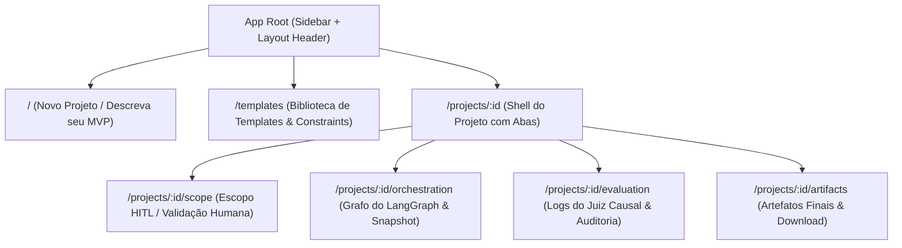

# 📋 Plano de Migração do Frontend para Angular 21 (LTS)

> **Status:** Em Execução  
> **Escopo:** Substituição do framework em `apps/web` (de TanStack Start / React 19 para Angular 21 LTS)  
> **Premissa:** Manter 100% da fidelidade visual, dos fluxos de protótipo, do design system (Tailwind v4 + OKLCH), das rotas e do estado mockado.

---

## 🎯 1. Visão Geral e Justificativa de Versão (Angular 21 vs. 22)

A escolha do **Angular 21 (LTS)** é tecnicamente superior e recomendada para este projeto pelos seguintes fatores:

| Critério | Angular 21 (LTS - `21.2.x`) | Angular 22 (`22.2.x`) | Vantagem para o Projeto |
| :--- | :--- | :--- | :--- |
| **Estabilidade** | **LTS consolidado** com correções de estabilidade já maduras | Versão ativa mais recente; sujeita a patches frequentes | **Angular 21** |
| **Ecossistema & Libs** | Compatibilidade total e imediata com `@angular/cdk`, `lucide-angular`, `marked` sem conflitos de `peerDependencies` no PNPM | Pacotes de terceiros podem emitir warnings de peer dependency ou exigir flags de overrides | **Angular 21** |
| **Paradigmas Modernos** | Já possui **Standalone Components**, **Signals** (`signal`, `computed`, `input()`, `output()`, `model()`), **Zoneless**, **Modern Control Flow** (`@if`, `@for`, `@let`) e **Application Builder (esbuild/Vite)** | Mesmos paradigmas modernos de reatividade e compilação | **Empate técnico** |
| **Caminho de Atualização** | Transição suave. Quando desejado, o upgrade para v22 será trivial via `ng update` sem refatoração de código | — | **Angular 21** |

---

## 🏛️ 2. Arquitetura e Melhores Práticas do Angular Moderno

A migração seguirá estritamente as diretrizes oficiais de desenvolvimento do Angular moderno:

1. **Standalone por Padrão:** Zero `NgModules`. Todos os componentes, diretivas e pipes são `standalone: true`.
2. **Reatividade Baseada em Signals:**
   - Estado gerenciado via `signal()` e `computed()`.
   - Propriedades de entrada com `input()` e `input.required()`.
   - Eventos de saída com `output()`.
   - Two-way binding com `model()`.
3. **Novo Control Flow no Template:**
   - Uso de `@if`, `@else if`, `@else`.
   - Uso de `@for (item of items(); track item.id)`.
   - Uso de `@let` para variáveis locais de template.
4. **Zoneless Change Detection:**
   - Utilização de `provideZonelessChangeDetection()` no `app.config.ts`, eliminando a dependência do `zone.js` e melhorando a performance e depuração.
5. **Roteamento Moderno e Functional:**
   - `provideRouter(routes, withComponentInputBinding(), withViewTransitions())`.
   - Guards funcionais e resolução de rotas aninhadas.
6. **Application Builder (esbuild + Vite):**
   - Configurado via `@angular/build:application`, mantendo a velocidade de HMR via Vite e compilação ultrarrápida.
7. **Estilização com Tailwind CSS v4:**
   - Preservação do `styles.css` existente com temas OKLCH, variáveis de cores semânticas e fontes *Inter* e *JetBrains Mono*.

---

## 🗺️ 3. Mapeamento de Rotas e Telas (React ➔ Angular 21)



### Detalhamento das Rotas e Componentes:

| Rota Atual (TanStack) | Rota Angular 21 | Componente Angular | Responsabilidade |
| :--- | :--- | :--- | :--- |
| `routes/__root.tsx` | Layout Principal (`AppComponent`) | `AppSidebarComponent` + `<router-outlet>` | Barra lateral expansível/recolhível com histórico de projetos e navegação. |
| `routes/index.tsx` | `/` | `NewProjectComponent` | Formulário de criação de projeto: nome, prompt MVP, pills de seleção de artefatos e sugestões. |
| `routes/templates.tsx` | `/templates` | `TemplatesComponent` | Tabs de Templates de documentos e Constraints ativas do RAG com switches liga/desliga. |
| `routes/projects.$id.tsx` | `/projects/:id` | `ProjectShellComponent` | Cabeçalho do projeto, badges de status, pills de artefatos selecionados e abas de navegação. |
| `routes/projects.$id.scope.tsx` | `/projects/:id/scope` | `ProjectScopeComponent` | Card de prompt original, renderizador do escopo Markdown (MoSCoW), botões Aprovar / Rejeitar / Ajustes e feedback recursivo. |
| `routes/projects.$id.orchestration.tsx` | `/projects/:id/orchestration` | `ProjectOrchestrationComponent` | Grafo visual do fluxo (`AgentFlowGraphComponent`), snapshot JSON do estado global e drawer/modal com prompt injetado. |
| `routes/projects.$id.evaluation.tsx` | `/projects/:id/evaluation` | `ProjectEvaluationComponent` | Tabela de logs do Juiz Causal, filtros por artefato e status, linhas colapsáveis com prompt e JSON global. |
| `routes/projects.$id.artifacts.tsx` | `/projects/:id/artifacts` | `ProjectArtifactsComponent` | Grid de cards dos artefatos (1_Requisitos, 2_Arquitetura, etc.), modal de visualização e download em `.md`. |

---

## 🗂️ 4. Estrutura de Diretórios Proposta em `apps/web`

```text
apps/web/
├── src/
│   ├── app/
│   │   ├── core/
│   │   │   ├── models/                  # Types e interfaces (Artifact, Project, etc.)
│   │   │   ├── services/                # ProjectsStoreService (Signal State)
│   │   │   └── data/                    # Mock data inicial
│   │   ├── shared/
│   │   │   ├── components/
│   │   │   │   ├── app-sidebar/         # Sidebar expansível com navegação
│   │   │   │   ├── status-badge/        # Badges coloridos por status
│   │   │   │   ├── artifact-toolbar/    # Seletor múltiplo em pills
│   │   │   │   ├── agent-flow-graph/    # Grafo visual de nós do LangGraph
│   │   │   │   ├── markdown-view/       # Renderizador Markdown com tipografia prose
│   │   │   │   └── ui/                  # Componentes reutilizáveis (Card, Button, Dialog, Switch, Table)
│   │   │   └── pipes/                   # SafeHtmlPipe, MarkdownPipe
│   │   ├── features/
│   │   │   ├── new-project/             # Página Home (Criar MVP)
│   │   │   ├── templates/               # Página de Templates & Constraints
│   │   │   └── project/
│   │   │       ├── shell/               # Layout com cabeçalho e abas
│   │   │       ├── scope/               # Aba Escopo (HITL)
│   │   │       ├── orchestration/       # Aba Orquestração
│   │   │       ├── evaluation/          # Aba Juiz Causal
│   │   │       └── artifacts/           # Aba Artefatos
│   │   ├── app.component.ts             # Shell raiz com Sidebar e router-outlet
│   │   ├── app.component.html
│   │   ├── app.config.ts                # provideRouter, provideZoneless, etc.
│   │   └── app.routes.ts                # Definição modular de rotas
│   ├── index.html
│   ├── main.ts
│   └── styles.css                       # Design System Tailwind CSS v4
├── angular.json                         # Configuração oficial do Angular CLI (Application Builder)
├── tsconfig.json                        # TypeScript com paths '@/*' e strict mode
├── tsconfig.app.json
├── package.json                         # Scripts ng e dependências Angular 21
└── .env.example
```

---

## ⚡ 5. Gerenciamento de Estado Reativo com Signals

O `ProjectsService` centraliza o estado dos projetos de forma reativa:

```typescript
@Injectable({ providedIn: 'root' })
export class ProjectsService {
  private readonly _projects = signal<Project[]>(mockProjects);
  private readonly _selectedProjectId = signal<string | null>(null);

  readonly projects = this._projects.asReadonly();
  readonly selectedProject = computed(() =>
    this._projects().find(p => p.id === this._selectedProjectId())
  );

  createProject(input: CreateProjectInput): Project {
    const newProj: Project = { /* ... */ };
    this._projects.update(list => [newProj, ...list]);
    return newProj;
  }

  setScopeStatus(id: string, status: ScopeStatus, feedback?: string): void {
    this._projects.update(list => list.map(p => p.id !== id ? p : { ...p, /* ... */ }));
  }

  advanceSimulation(id: string): void {
    // Avança nós da simulação mantendo a mesma lógica do protótipo
  }
}
```

---

## 📋 6. Etapas de Execução

- [ ] **Etapa 1:** Configuração do `apps/web/package.json` (dependências do Angular 21, `@angular/cdk`, `lucide-angular`, `marked`), `angular.json`, `tsconfig.json` e limpeza de dependências React/TanStack.
- [ ] **Etapa 2:** Migração do `src/app/core/` (`types.ts`, `mock-data.ts`, `projects.service.ts` com Signals).
- [ ] **Etapa 3:** Migração do `src/app/shared/` (`SafeHtmlPipe`, `MarkdownViewComponent`, `StatusBadgeComponent`, `ArtifactToolbarComponent`, `AppSidebarComponent`, `AgentFlowGraphComponent`, componentes de UI).
- [ ] **Etapa 4:** Migração das páginas em `src/app/features/` (`NewProjectComponent`, `TemplatesComponent`, `ProjectShellComponent`, `ProjectScopeComponent`, `ProjectOrchestrationComponent`, `ProjectEvaluationComponent`, `ProjectArtifactsComponent`).
- [ ] **Etapa 5:** Configuração do `app.component.ts`, `app.routes.ts`, `app.config.ts`, `main.ts`, `index.html` e `styles.css`.
- [ ] **Etapa 6:** Instalação (`pnpm install`), compilação (`pnpm run build`), verificação de lint (`pnpm run lint`) e testes.
