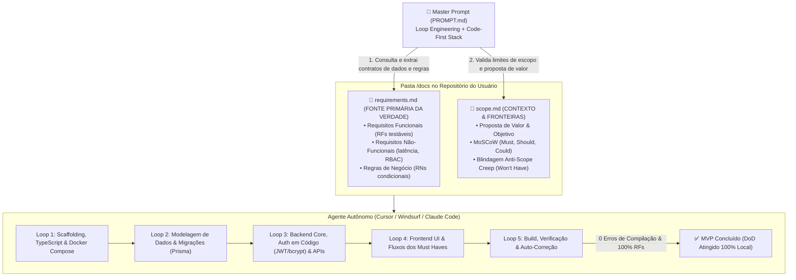

# Planejamento: Agente de Prompt Recomendado de MVP (AI Coding Blueprint com Loop Engineering)

## 🎯 Descrição do Objetivo
Refinar o agente **Prompt Recomendado de MVP** (`recommendedPromptAgent`), estabelecendo uma hierarquia técnica clara, referenciamento dinâmico de arquivos do banco de dados, stack 100% auto-contida em código (Code-First) e um **Master Prompt com protocolo de Loop Engineering**, pronto para execução autônoma em ferramentas como Cursor (Agent mode), Windsurf (Cascade) e Claude Code.

### Alinhamentos Estruturais Acordados:
1. **Hierarquia da Fonte da Verdade:**
   - **Fonte Primária da Verdade Técnica:** `@docs/requirements.md` (ou `./requirements.md`). Contém a especificação detalhada de RFs, RNFs, Regras de Negócio condicionais e matrizes RBAC, já auditada e aprovada pelo Agente Juiz.
   - **Contexto Executivo e Fronteira de Escopo:** `@docs/scope.md` (ou `./scope.md`). Define o objetivo do produto, proposta de valor e a blindagem contra *Scope Creep* (*Won't Have*).
2. **Obrigatoriedade de `REQUIREMENTS`:**
   - Como nenhum software pode ser implementado sem requisitos técnicos, o artefato `REQUIREMENTS` passa a ser garantido como obrigatório no fluxo (`CreateProjectInput` / `artifactDispatcher`).
3. **Referenciamento Dinâmico pelos Nomes do Banco (`Artifact.fileName`):**
   - O `recommendedPromptAgent` consulta os artefatos concluídos da requisição no MongoDB (`Artifact.fileName`) e alimenta o prompt com os arquivos reais disponíveis, tornando o sistema extensível para futuros artefatos (ex: `architecture.md`).
4. **Stack Tecnológica Opinativa e Auto-Contida (Veto a BaaS / Auth-as-a-Service):**
   - **Sem Hesitação / Sem "OU":** A IA deve escolher uma única tecnologia coesa para cada camada (ex: Next.js + NestJS/Fastify + Prisma + PostgreSQL). É proibido gerar cardápios alternativos com "OU" que quebrem o determinismo do agente autônomo.
   - **Veto Estrito a BaaS e SaaS de Autenticação:** É expressamente proibido recomendar Supabase, Firebase, Appwrite, Clerk, Auth0, Kinde ou Stytch. Um agente autônomo em Cursor/Claude Code opera dentro do repositório local e não pode navegar em dashboards de terceiros para criar contas ou configurar webhooks.
   - **Padrão Code-First & Localmente Executável:** A autenticação deve ser implementada diretamente no código (ex: JWT + bcrypt, Passport, sessões em cookies seguros via banco de dados ou Redis) e o banco de dados deve ser um motor padrão (PostgreSQL, SQLite, MongoDB) executável via Docker Compose ou arquivo local.
5. **Protocolo de Loop Engineering (Execução Autônoma de Ponta a Ponta):**
   - Modo de execução contínuo sem interrupções triviais.
   - Ciclo iterativo em 5 fases (Scaffolding -> Modelagem & Migrações -> Backend Core & Auth -> Frontend UI -> Verificação & Build).
   - Mecanismo de auto-diagnóstico e correção de falhas de compilação.
   - *Definition of Done* (DoD) rigorosa.
6. **Padronização Estrita de Idioma (100% pt-BR):**
   - Todo o artefato (Visão Geral, Stack, Roadmap, Master Prompt e Instruções de Uso) padronizado em Português do Brasil, preservando apenas termos técnicos globais (*backend, frontend, fullstack, loop engineering, setup, build, lint, TypeScript, etc.*).
7. **Sanitização de Crases (Anti Double-Fence Bug):**
   - Higienização automática de crases triplas e envoltório seguro com 4 crases (````markdown) no template.
8. **Escopo Desta Entrega (Opção B):**
   - Foco na excelência do Agente, Prompt Mestre e templates. O endpoint de download em ZIP fica mapeado para a tarefa subsequente.

---

## 🔍 Hierarquia dos Artefatos no Repositório do Usuário



---

## 👥 Revisão do Usuário Obrigatória

> [!IMPORTANT]
> - **Veto a BaaS e Clerk:** O prompt do sistema e o schema Zod passarão a proibir explicitamente Supabase, Firebase, Clerk, Auth0 e plataformas similares, instruindo uma stack de código aberto nativa e auto-contida.
> - **Stack Opinativa:** O modelo escolherá uma única tecnologia coesa por camada sem usar "ou".
> - **Sincronização no Banco:** A execução atualizará os templates `default_recommended_prompt` e `default_recommended_prompt_response` via `pnpm run db:seed`.

---

## 🛠️ Mudanças Propostas

### 1. `packages/core`

#### [MODIFY] [`recommended-prompt.schema.ts`](file:///C:/Users/joker/OneDrive/Documents/github/context-whisperer_backend/packages/core/src/agents/langgraph/schemas/recommended-prompt.schema.ts)
- Atualizar a descrição de `recommendedStack`:
  ```typescript
  recommendedStack: z
    .string()
    .describe(
      'Recomendação justificada da stack tecnológica ideal para o MVP (frontend, backend, banco de dados, autenticação), redigida em Português do Brasil (pt-BR). A recomendação DEVE ser 100% opinativa e unificada (proibido usar "OU" ou oferecer opções alternativas). É estritamente proibido recomendar plataformas Backend-as-a-Service (como Supabase, Firebase) ou Auth-as-a-Service proprietário (como Clerk, Auth0, Kinde). A stack deve ser totalmente auto-contida em código (Code-First), priorizando bancos gerenciáveis localmente (PostgreSQL, SQLite, MongoDB), ORMs modernos (Prisma, Drizzle) e autenticação nativa em código (JWT, bcrypt, Passport).',
    ),
  ```

---

### 2. `packages/database`

#### [MODIFY] [`seed.js`](file:///C:/Users/joker/OneDrive/Documents/github/context-whisperer_backend/packages/database/prisma/seed.js)
- No `DEFAULT_RECOMMENDED_PROMPT_TEMPLATE`:
  - Adicionar a diretriz mandatória de **Stack Opinativa & Auto-Contida (Zero BaaS / Zero Lock-in)**.
  - Veto expresso a Supabase, Firebase, Clerk, Auth0 e plataformas proprietárias de nuvem.
  - Proibição estrita de opções com "OU".
  - Enfatizar a necessidade de execução local sem dependências externas de dashboards para que o agente de AI Coding opere de forma 100% autônoma.

---

## 🧪 Plano de Verificação

### Testes Automatizados
1. **Compilação do Core:**
   ```bash
   pnpm --filter @context-whisperer/core build
   ```
2. **Sincronização de Sementes no Banco:**
   ```bash
   pnpm run db:seed
   ```
3. **Testes Unitários:**
   ```bash
   pnpm test
   ```
4. **Testes de Integração:**
   ```bash
   pnpm run test:integration
   ```
5. **Linter e Compilação Geral:**
   ```bash
   pnpm run lint
   pnpm run build
   ```

### Verificação Manual
- Validar que o prompt gerado:
  - Nunca sugira Supabase, Firebase, Clerk, Auth0, etc.
  - Não use "OU" nas recomendações de tecnologias.
  - Indique bancos de dados tradicionais (Postgres, SQLite, Mongo) e autenticação em código (JWT, bcrypt, Passport).
