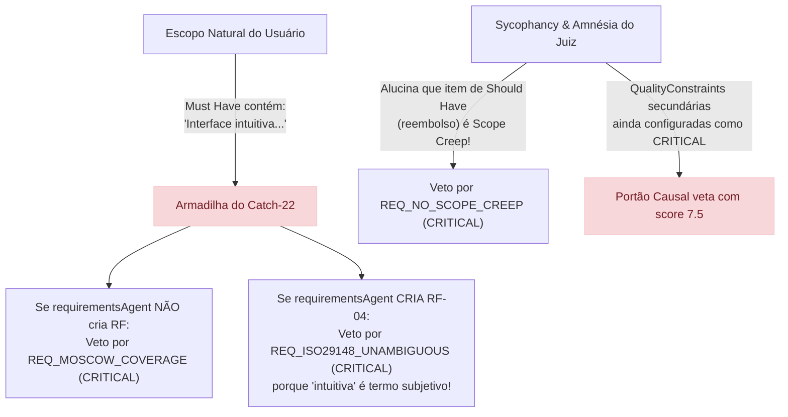
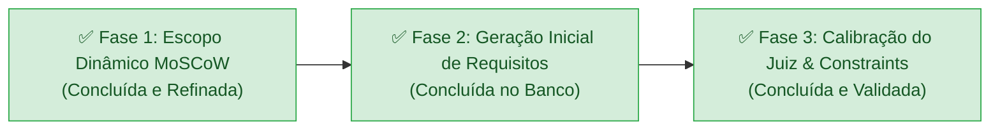

# Planejamento: Qualidade de Geração Inicial, Escopo Dinâmico e Calibração do Juiz Causal

Este documento consolida o planejamento arquitetural e técnico revisado após a **autópsia forense da execução real** (requisição `6aad5a4ffd55eec750bcd08f`), incorporando as definições alinhadas sobre **manutenção da nota mínima em 8.0**, **responsabilidade do gerador na tradução de usabilidade**, **manutenção da testabilidade como CRITICAL**, **combate ao sycophancy do Juiz** e **desacoplamento polimórfico para novos artefatos futuros**.

---

## 1. Autópsia Forense da Execução Real (`6aad5a4ffd55eec750bcd08f`)

A análise aprofundada dos registros do banco de dados revelou os fatores determinantes para o esgotamento do loop de retrabalho (`FAILED_WITH_WARNINGS` com nota **7.5** nas 3 iterações):



### Principais Diagnósticos:
1. **O Catch-22 da Usabilidade no Escopo:** O usuário colocou *"Interface de usuário intuitiva"* no Must Have. Como a regra `REQ_MOSCOW_COVERAGE` exigia que todo Must Have virasse um RF, e a regra `REQ_ISO29148_UNAMBIGUOUS` (CRITICAL) proibia a palavra "intuitiva", o gerador ficou preso: qualquer escolha gerava veto sumário.
2. **A Alucinação de *Scope Creep* no Juiz:** Na Iteração 2, o Juiz disparou `REQ_NO_SCOPE_CREEP` alegando que "reembolso não estava no escopo", embora estivesse explicitamente aprovado no *Should Have*.
3. **A Amnésia do Juiz nas Retentativas:** O Juiz reavaliava o documento do zero a cada ciclo, gerando *moving goalposts* (metas móveis) e inventando novas críticas a cada rodada.
4. **Severidade Incorreta de Regras Secundárias:** Regras de ambiguidade e métricas de desempenho configuradas como `CRITICAL` forçavam o portão causal (`hasCritical = true`) a reprovar o documento, mesmo com score 7.5.

---

## 2. Decisões Arquiteturais Fundamentais

### 🎯 1. Manutenção da Nota Mínima em `8.0` (Sem Rebaixamento de Régua)
- **Decisão:** O piso de corte `minPassingScore` **permanecerá em 8.0**.
- **Racional:** A nota 7.5 foi fruto de 4 deduções provocadas pelo Catch-22 e pela falta de detalhamento de RBAC/testes. Ao sanar esses pontos, a nota técnica da especificação atinge 8.5 a 9.0 com facilidade. Baixar a régua mascararia o problema em vez de resolvê-lo.

### 🧑‍💻 2. Escopo Natural & Tradução Técnica pelo Gerador (`requirementsAgent`)
- **Decisão:** O `scopeAgent` **não** proibirá o usuário de considerar usabilidade/experiência como *Must Have*. É natural do ser humano pensar em usabilidade como algo essencial.
- **Responsabilidade do Gerador:** O `requirementsAgent` será capacitado para traduzir o desejo de usabilidade suavemente:
  1. Em um **Requisito Funcional (RF)** de fluxo operacional observável (ex: *RF-04: Fluxo de Checkout e Navegação Simplificada*).
  2. Em um **Requisito Não-Funcional (RNF)** de usabilidade com critérios objetivos de tela/cliques.
- **Adaptação no Juiz:** O Juiz reconhecerá que expectativas de experiência do *Must Have* são 100% satisfeitas por fluxos de tela correspondentes ou RNFs de usabilidade.

### 🛡️ 3. Severidades Calibradas: Testabilidade Inegociável (`CRITICAL`)
- **`REQ_ISO29148_TESTABILITY` ➔ MANTIDO `CRITICAL`:** Se um requisito não possui critérios de teste observáveis (entrada, processamento e saída verificável), o QA não consegue homologar e os desenvolvedores não sabem quando terminaram. Permanece veto sumário.
- **`REQ_MOSCOW_COVERAGE` e `REQ_NO_SCOPE_CREEP` ➔ MANTIDOS `CRITICAL`:** Preservam a fidelidade estrita ao escopo.
- **`REQ_ISO25010_SECURITY_AUTH` ➔ MANTIDO `CRITICAL`:** Falta de autenticação e RBAC em dados sensíveis é falha fatal.
- **`REQ_ISO29148_UNAMBIGUOUS` ➔ `WARNING`:** Adjetivos descritivos descontam pontos, mas não vetam um MVP funcional.
- **`REQ_ISO25010_PERFORMANCE_METRIC` ➔ `WARNING`:** Omissão de métricas avançadas (como RPS de pico) gera recomendação construtiva, sem abortar a entrega.
- **`REQ_BABOK_CONDITIONAL_LOGIC` ➔ `WARNING`:** Formatação de regras gera aviso de polimento.

---

## 3. Combate ao Sycophancy do Juiz e Desacoplamento Polimórfico

Para combater o viés do juiz em "inventar defeitos a qualquer custo" (*Sycophancy / Pedantic Drift*) sem acoplar o prompt a regras específicas de Requisitos, adotaremos uma formulação baseada em princípios gerais de impacto:

### 🧩 1. Desacoplamento Polimórfico (Compatibilidade com Futuros Artefatos)
O prompt do Juiz **não cita nomes específicos de restrições ou termos de requisitos**. O catálogo no banco de dados (`QualityConstraint`) é a única fonte da verdade. O prompt estabelece a filosofia conceitual de severidade com exemplos neutros:

```text
DIRETRIZES DE SEVERIDADE E IMPACTO:
Ao identificar uma inconformidade em relação a uma restrição ativa do catálogo, atribua a severidade respeitando o critério de impacto real no ciclo de desenvolvimento:

- CRITICAL (Defeito Bloqueante):
  Inconformidades que comprometem a integridade fundamental do artefato, omitem elementos mandatórios acordados na etapa anterior, criam contradições lógicas graves, quebram a testabilidade por QA ou tornam o artefato impossível de ser implementado ou validado tecnicamente.
  * Exemplo Conceitual: Uma especificação que omite uma capacidade obrigatória acordada, que não possui critérios observáveis de teste ou que descreve um comportamento inexecutável possui um defeito de natureza bloqueante.

- WARNING (Oportunidade de Polimento):
  Ressalvas sobre precisão de termos, oportunidades de detalhamento incremental, sugestões de métricas futuras ou boas práticas que enriquecem o artefato, mas cuja ausência não invalida sua utilidade primária para o MVP.
  * Exemplo Conceitual: Uma solução que descreve a capacidade essencial com clareza funcional, mas cuja terminologia poderia ser mais formal ou cujas métricas complementares de produção poderiam ser refinadas posteriormente, recebe uma recomendação construtiva com dedução proporcional na nota, sem bloquear o fluxo.
```

### 🧠 2. Contexto de Iteração e Anti-Moving Goalposts
No `judge-agent.node.ts`, o Juiz receberá o número da iteração e o diagnóstico do ciclo anterior:
- Em iterações > 1, o Juiz deve auditar prioritariamente a resolução dos remédios solicitados no ciclo anterior.
- O Juiz é orientado a evitar reabrir discussões estilísticas sobre seções não modificadas, mantendo novas críticas restritas a eventuais regressões reais introduzidas pelo refinamento.

### 🤝 3. Imparcialidade e Presunção de Conformidade Pragmática
- O Juiz é orientado a avaliar pelo mérito técnico e impacto prático na engenharia.
- Reconhece expressamente que itens listados em *Should Have* são escopo legítimo e válido (eliminando a alucinação de *Scope Creep*).
- Se a especificação cumprir os requisitos mandatórios com critérios observáveis de teste e segurança essencial, o Juiz deve atribuir nota condizente (>= 8.0) e aprovar o artefato.

---

## 4. Roteiro de Execução (100% Concluído)



### Entregáveis da Fase 3 (Executados e Verificados):
1. **Sincronização de Constraints (`seed.js` e MongoDB):**
   - Reclassificados para `WARNING`: `REQ_ISO29148_UNAMBIGUOUS`, `REQ_ISO25010_PERFORMANCE_METRIC` e `REQ_BABOK_CONDITIONAL_LOGIC`.
   - Mantidos como `CRITICAL`: `REQ_ISO29148_TESTABILITY` (critérios observáveis para QA não-negociáveis), `REQ_MOSCOW_COVERAGE`, `REQ_NO_SCOPE_CREEP`, `REQ_ISO25010_SECURITY_AUTH` e `REQ_ISO25010_SECURITY_CONFIDENTIALITY`.
   - Atualizada a descrição de `REQ_MOSCOW_COVERAGE` para aceitar que expectativas de usabilidade/experiência sejam atendidas por fluxos de telas ou RNFs de usabilidade.
2. **Atualização do Prompt do Juiz (`seed.js` e Template no Banco):**
   - Aplicadas as diretrizes desacopladas de severidade por impacto real no software.
   - Presunção de conformidade pragmática: avaliação orientada ao mérito técnico sem converter preferências de estilo em defeitos bloqueantes.
   - Reconhecimento explícito de que itens de *Should Have* são escopo aprovado legítimo.
   - Template `judge_requirements_prompt` atualizado no MongoDB via `prisma.template.upsert`.
3. **Injeção do Contexto de Iteração em `judge-agent.node.ts` (Combate a Sycophancy e Moving Goalposts):**
   - O agente calcula `currentIteration` antes de montar o prompt.
   - Em iterações > 1, busca a avaliação anterior (`prisma.artifactEvaluation.findFirst`) e injeta no prompt os apontamentos críticos anteriores e o feedback contrafactual fornecido, orientando o Juiz a verificar estritamente a resolução das deficiências sem deslocar critérios arbitrariamente.
   - Atualizado o prompt de retrabalho do `requirements-agent.node.ts` para reforçar a rastreabilidade do MoSCoW.
4. **Execução de `pnpm run db:seed` e Validação de Testes:**
   - Seed executado com sucesso (11 constraints sincronizadas e templates atualizados).
   - Testes unitários (`pnpm test`): 100% de sucesso (113 testes passando).
   - Testes de integração (`pnpm run test:integration`): 100% de sucesso (8 testes passando, incluindo ciclo completo de rework e aprovação).
   - Linter e typecheck (`pnpm run lint`): 0 erros.
