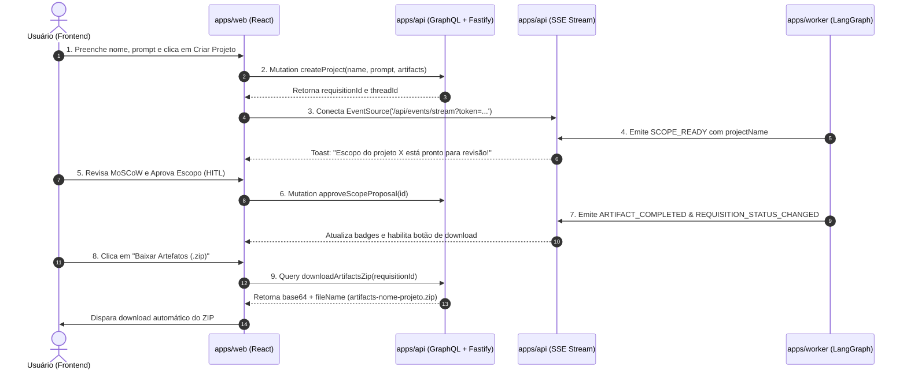

# Guia de Engenharia: Setup e Migração do Frontend para o Monorepo

Este documento fornece as instruções arquiteturais e o passo a passo prático para trazer o projeto de **Frontend** (atualmente um protótipo de alta fidelidade com integrações antigas/mockadas) para dentro do monorepo PNPM do **Context-Whisperer**.

---

## 🎯 1. Escopo e Diretriz da Primeira Tarefa

> [!IMPORTANT]
> **FOCO DESTA FASE (FASE 1: SETUP & ONBOARDING):**
> O objetivo desta etapa é estritamente **estrutural e de ambiente**:
> 1. Alocar o frontend no monorepo (`apps/web`).
> 2. Configurar o workspace do PNPM, dependências e TypeScript.
> 3. Integrar com o pacote compartilhado `@context-whisperer/core`.
> 4. Garantir que os comandos `pnpm run build`, `pnpm run lint` e o script de desenvolvimento (`start:dev:web`) rodem sem quebrar o monorepo.
> 
> **FORA DO ESCOPO DESTA FASE (FASE 2: INTEGRAÇÃO REAL):**
> Substituição de mocks por chamadas reais de GraphQL, reconexão de SSE em tempo real, ajustes de tela ou refatoração profunda de componentes. Esses itens serão tratados na fase seguinte.

---

## 🗺️ 2. Topologia do Monorepo com o Frontend

Após o setup, a estrutura de aplicações e pacotes compartilhados será:

```text
context-whisperer_backend/
├── apps/
│   ├── api/                     # Backend NestJS (Fastify + GraphQL + Auth + BullMQ Producer)
│   ├── worker/                  # Worker LangGraph (Consumidor BullMQ + IA + Juiz Causal)
│   └── web/                     # 🌐 [NOVO] Frontend (React/Next.js/Vite + Tailwind + UI)
├── packages/
│   ├── core/                    # DTOs, Enums (ArtifactType, SseEventType), Schemas Zod
│   └── database/                # Schema Prisma, Migrações e Singleton MongoDB
├── ideias/                      # Documentação técnica e planejamento arquitetural
├── pnpm-workspace.yaml          # Configuração de workspaces (já inclui 'apps/*')
└── package.json                 # Scripts orquestradores na raiz
```

---

## 📋 3. Passo a Passo Prático de Migração

### Passo 1: Copiar o Projeto Frontend Existente para `apps/web/`

Como o frontend já é um projeto existente (protótipo de alta fidelidade), **não se deve criar arquivos do zero nem inventar dependências antecipadamente**. 

Você simplesmente copiará o diretório do frontend para dentro de `apps/web/`, tomando apenas o cuidado de **não levar arquivos transitórios**:

1. **O que DELETAR/IGNORAR na cópia:**
   - ❌ `node_modules/` (será instalado de forma unificada e limpa pelo PNPM).
   - ❌ `package-lock.json`, `yarn.lock` ou `bun.lockb` (o monorepo utiliza exclusivamente o `pnpm-lock.yaml` da raiz).
   - ❌ `.git/` (para não criar submódulos acidentais; o código fará parte do repositório principal).
   - ❌ Pastas de build geradas anteriormente (`dist/`, `.next/`, `build/`, `.turbo/`).

2. **O que COPIAR para `apps/web/`:**
   - ✅ Todo o código-fonte (`src/`, `public/`, etc.).
   - ✅ Arquivos de configuração originais (`vite.config.ts` ou `next.config.js`, `tailwind.config.js`, `postcss.config.js`, `tsconfig.json`).
   - ✅ O arquivo `package.json` **original do frontend**, com todas as suas dependências reais que já funcionam no protótipo.

---

### Passo 2: Ajuste Mínimo no `package.json` que Já Veio com o Front

No `package.json` que você acabou de colar em `apps/web/package.json`, você só precisa fazer **duas alterações pontuais**:

1. Alterar o nome do pacote para seguir a convenção de namespace do monorepo:
   ```json
   "name": "@context-whisperer/web",
   "private": true,
   ```

2. (Opcional, mas recomendado) Adicionar a dependência do core compartilhado para tipagens:
   ```json
   "dependencies": {
     ...suas dependências reais que já estavam no projeto...,
     "@context-whisperer/core": "workspace:*"
   }
   ```

> [!NOTE]
> **Preserve todas as outras dependências e scripts intactos!** Se o frontend já usa Vite, Tailwind, Lucide, Radix, etc., mantenha exatamente as versões que já estavam nele. Não adicione nada extra agora.

---

### Passo 3: Instalação das Dependências Reais pelo PNPM

Com a pasta `apps/web` no lugar e o `package.json` renomeado, vá até a **raiz do monorepo** e execute:

```bash
pnpm install
```

O PNPM fará a leitura automática do workspace `apps/web`, resolverá todas as dependências que o frontend realmente precisa, criará o link simbólico local com `@context-whisperer/core` e atualizará o `pnpm-lock.yaml` central.

---

### Passo 4: Mapear o Script de Execução na Raiz

Abra o `package.json` da **raiz do monorepo** e adicione o comando apontando para o script de desenvolvimento que o frontend já possui (seja `dev` no Vite/Next ou `start` no CRA):

```json
{
  "scripts": {
    "build": "pnpm -r build",
    "start:dev:api": "pnpm --filter @context-whisperer/api start:dev",
    "start:dev:worker": "pnpm --filter @context-whisperer/worker start:dev",
    "start:dev:web": "pnpm --filter @context-whisperer/web dev",
    "lint": "pnpm -r lint",
    "test": "pnpm -r test"
  }
}
```
---

### Passo 5: Variáveis de Ambiente do Frontend

Crie o arquivo `apps/web/.env.example` (e copie para `apps/web/.env.local`):

```env
# URL da API do Context-Whisperer
VITE_API_URL=http://localhost:3000/api

# Endpoint GraphQL
VITE_GRAPHQL_URL=http://localhost:3000/api/graphql

# Endpoint Server-Sent Events (SSE)
VITE_SSE_STREAM_URL=http://localhost:3000/api/events/stream
```

*(Caso use Next.js, substitua o prefixo `VITE_` por `NEXT_PUBLIC_`)*.

---

## 🛡️ 4. Cuidados e Armadilhas Comuns no Monorepo

1. **Conflito de Versões de React:**
   - Certifique-se de que a versão de `react` e `@types/react` no `apps/web` seja compatível. Como o backend (`api` e `worker`) não usa React, não haverá conflito de versão com o backend.
2. **ESLint no Monorepo:**
   - O monorepo executa `pnpm -r lint` (executa o script `lint` de cada workspace).
   - O `apps/web` deve ter seu script de lint funcionando sem travar a pipeline global. Caso o ESLint do frontend use regras antigas, você pode configurar um `.eslintrc.cjs` dedicado dentro de `apps/web/` inicialmente.
3. **CORS e Comunicação Local:**
   - O backend Fastify em `apps/api` já possui suporte configurado para aceitar origens locais (`http://localhost:5173` no Vite ou `http://localhost:3000` no Next.js).

---

## 🧪 5. Validação da Migração

Para considerar a Fase 1 (Setup) concluída com sucesso, execute os seguintes comandos a partir da raiz:

```bash
# 1. Testar se o frontend sobe em modo de desenvolvimento
pnpm run start:dev:web

# 2. Testar se a compilação do monorepo completo passa (incluindo o novo app)
pnpm run build

# 3. Testar se o linter valida todo o monorepo sem erros
pnpm run lint
```

---

## 🚀 6. Visão Geral da Fase 2 (Próxima Etapa: Integração Real)

Após concluir o setup da Fase 1, a Fase 2 focará na substituição sistemática dos mocks por integrações nativas com os contratos que preparamos no backend:


