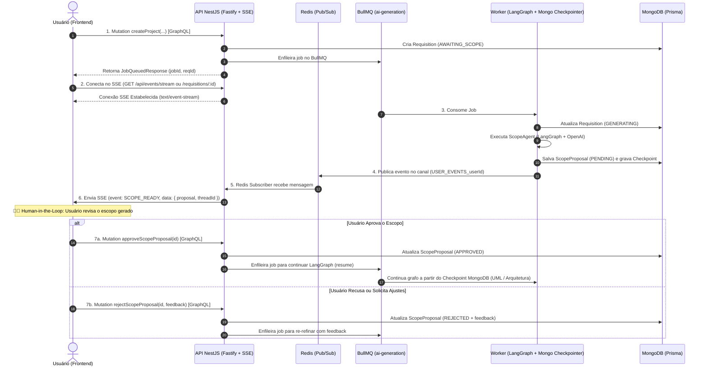

# Planejamento: Notificações em Tempo Real com Server-Sent Events (SSE) e Human-in-the-Loop

Este documento estabelece o planejamento arquitetural para a substituição de GraphQL Subscriptions por **Server-Sent Events (SSE)** como padrão oficial do monorepo para notificações unidirecionais em tempo real e orquestração de **Human-in-the-Loop (HITL)** durante a aprovação/recusa de escopo gerado por IA.

---

## 1. Contexto e Motivação

### 🎯 Por que migrar de GraphQL Subscriptions (WS) para Server-Sent Events (SSE)?
1. **Unidirecionalidade Natural:** As notificações de progresso da IA, escopo pronto e conclusão de artefatos são 100% servidor ➔ cliente (*push-only*). SSE é o padrão web ideal e nativo HTTP para esse padrão.
2. **Compatibilidade com Fastify & Proxies:** SSE roda sobre HTTP padrão (HTTP/1.1 e HTTP/2 com multiplexação), dispensando o overhead de handshake WebSocket e simplificando configurações de Cloud Load Balancers e Cloudflare.
3. **Resiliência e Reconexão Automática:** O protocolo SSE possui reconexão nativa no browser (`EventSource`) com suporte a `Last-Event-ID`.
4. **Desacoplamento Limpo:** GraphQL continua responsável estritamente por Queries e Mutations (operações de leitura e escrita), enquanto o SSE atua como barramento de streaming de eventos em tempo real.

---

## 2. Visão Geral da Arquitetura



---

## 3. Alternativas Estratégicas para Definição

### 📍 Alternativa 1: SSE por Usuário (`GET /api/events/stream`) [Recomendada]
- **Como funciona:** O cliente abre uma conexão única autenticada via token JWT (`/api/events/stream?token=...` ou header). O `EventsService` escuta o canal `USER_EVENTS_${userId}` no Redis e repassa todos os eventos daquele usuário em tempo real.
- **Vantagens:** 
  - 1 única conexão mantida no frontend para todo o ciclo do usuário (criação de projetos, aprovação de escopo, geração de diagramas UML, notificações globais).
  - Mais leve para o servidor e ideal para SPA (Single Page Application).
- **Desvantagens:** Payload do evento precisa conter `requisitionId` para o frontend filtrar qual tela/card atualizar.

### 📍 Alternativa 2: SSE por Requisição (`GET /api/events/requisitions/:requisitionId`)
- **Como funciona:** O cliente abre uma conexão SSE específica para a página daquela requisição. O canal no Redis é `REQUISITION_EVENTS_${requisitionId}`.
- **Vantagens:** Isolamento por página de projeto; fecha a conexão automaticamente quando o projeto é concluído.
- **Desvantagens:** Se o usuário navegar entre telas ou tiver 3 projetos gerando ao mesmo tempo, precisará abrir 3 conexões SSE separadas.

### 📍 Alternativa 3: Abordagem Híbrida
- Fornece tanto o endpoint global de usuário (`/api/events/stream`) quanto o endpoint focado de requisição (`/api/events/requisitions/:requisitionId`).

---

## 4. Tipos e Contratos de Eventos SSE (`packages/core`)

```typescript
export enum SseEventType {
  REQUISITION_STATUS_CHANGED = 'REQUISITION_STATUS_CHANGED',
  SCOPE_READY = 'SCOPE_READY',
  ARTIFACT_GENERATING = 'ARTIFACT_GENERATING',
  ARTIFACT_COMPLETED = 'ARTIFACT_COMPLETED',
  WORKFLOW_FAILED = 'WORKFLOW_FAILED',
}

export interface SseEventMessage<T = unknown> {
  id?: string;
  type: SseEventType;
  userId: string;
  requisitionId: string;
  threadId?: string;
  timestamp: string;
  data: T;
}
```

---

## 5. Roteiro de Implementação (Fases)

### 📌 Fase 1: Módulo e Infraestrutura SSE na API (`apps/api`)
- [x] Criar o `EventsModule`, `EventsService` (Redis Subscriber com `RxJS Subject`) e `EventsController` com `@Sse('stream')`.
- [x] Implementar autenticação no SSE (`SseAuthGuard` com suporte a Bearer Header e query param `?token=...`).
- [x] Suporte a *heartbeat* (ping periódico a cada 25s) para manter a conexão aberta em proxies e load balancers.

### 📌 Fase 2: Adaptação do Worker e Contratos
- [x] Padronizar payload dos eventos de publicação Redis no `scope-agent.node.ts` e `generation.processor.ts` utilizando os contratos do `packages/core` (`SseEventType.SCOPE_READY`, `SseEventType.REQUISITION_STATUS_CHANGED`, `SseEventType.WORKFLOW_FAILED`).
- [x] Remover dependências residuais de subscriptions do Mercurius (`agentEvents`).

### 📌 Fase 3: Resolvers de Aprovação/Recusa (Human-in-the-Loop)
- [x] Criar `ScopeProposalResolver` com mutations `approveScopeProposal` e `rejectScopeProposal` emitindo notificações em tempo real via `EventsService`.
- [x] Query `scopeProposal` para recuperação individual de propostas.

### 📌 Fase 4: Testes Unitários e de Integração
- [x] Testes unitários para `EventsService`, `EventsController` e `SseAuthGuard` (com mocks explícitos aderentes ao ESLint).
- [x] Testes unitários para `ScopeProposalResolver`.
- [x] Testes de integração do fluxo assíncrono do Worker com publicação de eventos SSE.
- [x] Validação: 100% de sucesso em 25 suítes de teste e 82 testes no monorepo.
