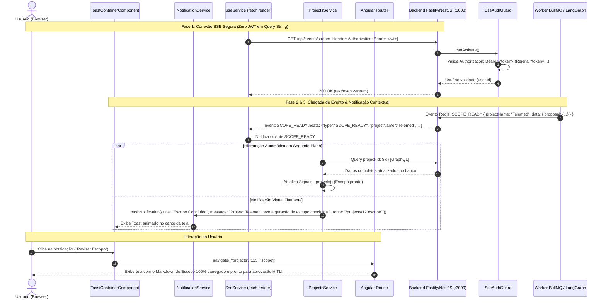

# 📋 Plano de Implementação: Reformulação Segura do SSE & Sistema Reativo de Notificações Contextuais

> **Status:** Concluído e Validado (Build 100%, 136 Testes Passando, Linter 0 erros)  
> **Fase 1:** Reformulação do Endpoint `/api/events/stream` (Eliminação do JWT em Query Params & Autenticação Segura via Header)  
> **Fase 2:** Sistema Reativo de Notificações Toast com Linguagem Natural e Ações Contextuais  
> **Fase 3:** Hidratação e Pré-carregamento Automático de Conteúdo nas Abas de Escopo e Artefatos

---

## 🎯 1. Visão Geral e Justificativa

A integração entre o backend Fastify/NestJS e o frontend Angular 21 avançou significativamente, mas a experiência de recebimento de eventos e a segurança do transporte exigem duas correções estruturais:

1. **Vulnerabilidade de Segurança no Endpoint SSE (Fase 1):**
   - Atualmente, a conexão SSE é estabelecida via `GET /api/events/stream?token=<jwt>`.
   - Passar JWT na query string expõe credenciais sensíveis em logs de servidores, proxies reversos (Nginx/Cloudflare), histórico do navegador e cabeçalhos `Referer`, violando as diretrizes de segurança da OWASP (CWE-598).
   - O endpoint deve ser reformulado para **rejeitar JWTs em query params** e exigir o cabeçalho padrão `Authorization: Bearer <token>` via conexão streaming HTTP nativa no frontend.

2. **Notificações Humanizadas com Ações Clicáveis e Pré-carregamento (Fase 2 e 3):**
   - Atualmente, o frontend não possui um sistema de feedback amigável ao usuário quando os eventos SSE chegam.
   - Em vez de notificações genéricas ou exibição direta de blocos brutos de Markdown em toasts, o usuário deve ser notificado com **mensagens semânticas claras** (ex: *"Projeto **Telemed** teve a geração de escopo concluída"*).
   - **Ao clicar na notificação:**
     - O usuário é direcionado imediatamente para a tela do projeto e na aba correta (ex: `/projects/:id/scope` para escopo, `/projects/:id/artifacts` para artefatos).
     - Os dados correspondentes já chegam **pré-carregados e hidratados em memória** (via consulta GraphQL `project(id)`), garantindo renderização instantânea do escopo ou dos artefatos sem depender de recarregamento manual (*sem F5*).

---

## 🗺️ 2. Arquitetura do Fluxo SSE e Notificações



---

## 🔍 3. Diagnóstico e Comparativo de Mudanças

| Aspecto | Estado Atual | Novo Estado Proposto |
| :--- | :--- | :--- |
| **Autenticação SSE** | `GET /api/events/stream?token=<jwt>` (Inseguro) | `GET /api/events/stream` com header `Authorization: Bearer <token>` (100% seguro) |
| **`SseAuthGuard`** | Aceita `?token=<jwt>` em query params | **Rejeita JWT puro em query string**; exige `Authorization: Bearer <token>` no header |
| **Cliente SSE (`apps/web`)** | `new EventSource()` clássico (ignora eventos nomeados no `onmessage`) | Leitor streaming HTTP via `fetch()` + `ReadableStream` com suporte a todos os eventos nomeados |
| **Feedback ao Usuário** | Silencioso / Sem feedback visual | Toasts semânticos humanizados: *"Projeto [Nome] teve a geração de escopo concluída"* |
| **Ação ao Clicar na Notificação** | Inexistente | Navega direto para a rota correta do projeto (`/scope`, `/artifacts`, etc.) |
| **Hidratação de Dados** | Usuário precisava dar F5 para buscar dados da API | Dispara `loadProjectById` em segundo plano assim que o evento chega, pré-hidratando a aba |

---

## 🛠️ 4. Proposta Detalhada por Componente

---

### Fase 1: Reformulação do Endpoint SSE (`apps/api`)

#### [MODIFY] `apps/api/src/modules/events/guards/sse-auth.guard.ts`
1. Remover a permissividade de leitura do JWT de `request.query.token`.
2. Validar estritamente o header `Authorization: Bearer <token>`:
   ```typescript
   const token = this.extractTokenFromHeader(request);
   if (!token) {
     throw new UnauthorizedException(
       'Token de autenticação não fornecido no cabeçalho Authorization para SSE',
     );
   }
   ```
3. Suporte a ticket handshake de uso único via `request.query.ticket` (para clientes sem suporte a custom headers).

#### [MODIFY] `apps/api/test/unit/events/sse-auth.guard.spec.ts`
- Atualizar a suíte de testes:
  - Garantir aprovação com header `Authorization: Bearer <token>`.
  - Garantir que requisições com `?token=...` ou sem cabeçalho Authorization sejam rejeitadas com `UnauthorizedException`.

---

### Fase 2: Leitor de Streaming Seguro & Despacho de Eventos (`apps/web`)

#### [MODIFY] `apps/web/src/app/core/services/sse.service.ts`
Substituir o `EventSource` pelo leitor de streaming nativo via `fetch`:
1. **Conexão Segura:**
   ```typescript
   const response = await fetch('/api/events/stream', {
     method: 'GET',
     headers: {
       'Authorization': `Bearer ${token}`,
       'Accept': 'text/event-stream',
     },
     signal: this.abortController.signal,
   });
   ```
2. **Parser SSE Completo:**
   - Consome chunks com `response.body.getReader()` e `TextDecoder`.
   - Separa blocos delimitados por `\n\n`.
   - Extrai `event: <nome>` e `data: <json>`.
   - Dispara os callbacks registrados para cada tipo de evento (`SCOPE_READY`, `REQUISITION_STATUS_CHANGED`, `ARTIFACT_GENERATING`, `ARTIFACT_COMPLETED`) e ouvintes globais `ALL`.
3. **Reconexão Resiliente:**
   - Reconexão automática com backoff exponencial utilizando sempre o token atualizado do `AuthService`.
   - Cancelamento limpo com `AbortController` no método `disconnect()`.

---

### Fase 3: Sistema de Notificações Toast & Hidratação de Dados (`apps/web`)

#### [NEW] `apps/web/src/app/core/services/notification.service.ts`
Serviço reativo (Angular Signals) para gerenciar toasts flutuantes na aplicação:
```typescript
export interface AppNotification {
  id: string;
  title: string;
  message: string;
  type: 'info' | 'success' | 'warning' | 'error';
  projectName?: string;
  requisitionId?: string;
  targetRoute?: string[];
  actionLabel?: string;
  createdAt: string;
}

@Injectable({ providedIn: 'root' })
export class NotificationService {
  private readonly _notifications = signal<AppNotification[]>([]);
  readonly notifications = this._notifications.asReadonly();

  push(notification: Omit<AppNotification, 'id' | 'createdAt'>): void { ... }
  dismiss(id: string): void { ... }
}
```

#### [NEW] `apps/web/src/app/shared/components/notifications/notification-toast.component.ts`
Componente visual de Toasts flutuantes:
- Renderizado globalmente no [`AppComponent`](file:///C:/Users/joker/OneDrive/Documents/github/context-whisperer_backend/apps/web/src/app/app.component.ts).
- Posicionado no canto superior direito (ou inferior direito).
- Design minimalista e profissional: bordas sutis em dark mode, badge com o nome do projeto, ícone de status, texto legível e botão de ação ("Ver Escopo", "Ver Artefatos").
- Ao clicar no toast ou no botão de ação, navega via `Router.navigate(n.targetRoute)` e descarta o toast.
- Timer de fechamento automático (8 segundos) com barra de progresso sutil ou botão fechar (X).

#### [MODIFY] `apps/web/src/app/core/services/projects.service.ts`
Integrar os ouvintes SSE ao `NotificationService` e ao pré-carregamento via `loadProjectById`:
1. **`SCOPE_READY`:**
   - Mensagem: `"Projeto \"${projectName}\" teve a geração de escopo concluída."`
   - Ação: `"Revisar Escopo"` -> Rota: `['/projects', reqId, 'scope']`
   - Pré-carregamento: chama `loadProjectById(reqId)` para hidratar o escopo completo imediatamente.
2. **`ARTIFACT_GENERATING`:**
   - Mensagem: `"O agente iniciou a geração do artefato ${artifactLabel} para o projeto \"${projectName}\"."`
   - Ação: `"Acompanhar"` -> Rota: `['/projects', reqId, 'orchestration']`
3. **`ARTIFACT_COMPLETED`:**
   - Mensagem: `"Artefato ${artifactLabel} do projeto \"${projectName}\" foi concluído e aprovado pelo Juiz."`
   - Ação: `"Ver Artefato"` -> Rota: `['/projects', reqId, 'artifacts']`
   - Pré-carregamento: chama `loadProjectById(reqId)` atualizando o conteúdo Markdown gerado.
4. **`REQUISITION_STATUS_CHANGED` (COMPLETED):**
   - Mensagem: `"Todos os artefatos do projeto \"${projectName}\" foram concluídos com sucesso."`
   - Ação: `"Ver Projeto"` -> Rota: `['/projects', reqId, 'artifacts']`

#### [MODIFY] `apps/web/src/app/app.component.ts`
- Incluir o `<app-notification-toast />` no template global para garantir visibilidade das notificações em todas as páginas.

---

## 🧪 5. Plano de Verificação e Homologação

### Testes Automatizados
```powershell
# 1. Testes unitários do SseAuthGuard refatorado no backend
pnpm --filter @context-whisperer/api test

# 2. Linter em todos os workspaces (0 erros)
pnpm run lint

# 3. Compilação completa do monorepo (0 erros)
pnpm run build

# 4. Suíte completa de testes unitários (136+ testes aprovados)
pnpm test
```

### Validação Manual (Ponta a Ponta)
1. **Inspeção de Rede (DevTools):**
   - Verificar na aba *Network* que a chamada para `/api/events/stream` **não contém `?token=...`** na URL e que o header `Authorization: Bearer <token>` é enviado.
2. **Criação de Projeto & Disparo de SSE:**
   - Criar um projeto chamado `"Telemed"`.
   - Navegar para outra página (ex: `/templates` ou home).
3. **Chegada da Notificação Toast:**
   - Ao receber o evento `SCOPE_READY`, observar o toast flutuante surgir:
     *"Projeto 'Telemed' teve a geração de escopo concluída."* com botão *"Revisar Escopo"*.
4. **Navegação Contextual & Hidratação Prévia:**
   - Clicar na notificação.
   - O navegador deve navegar para `/projects/:id/scope`.
   - O conteúdo do escopo (MoSCoW, requisitos, restrições) **já estará 100% renderizado e pronto para aprovação HITL**, sem telas em branco e sem necessidade de F5!
