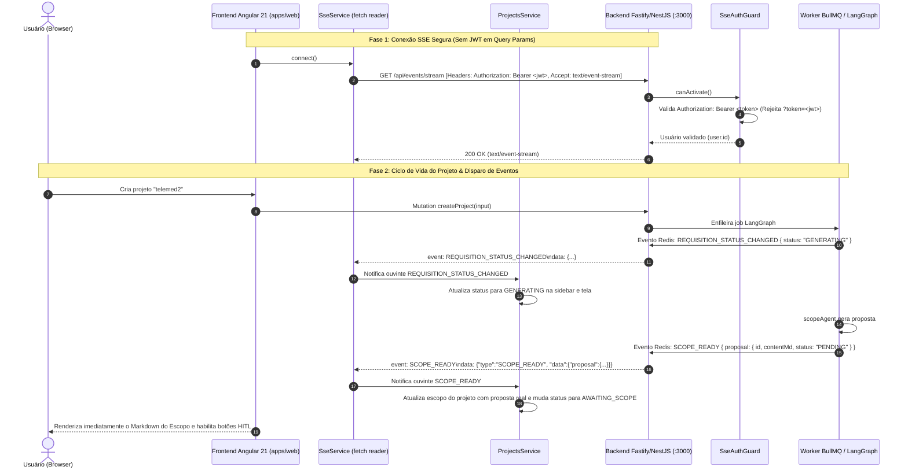

# 📋 Plano de Implementação: Reformulação do Endpoint SSE & Tratamento Reativo de Eventos no Frontend

> **Status:** Proposto / Aguardando Aprovação  
> **Fase 1:** Reformulação do Endpoint `/api/events/stream` (Eliminação de JWT em Query Params & Autenticação Segura)  
> **Fase 2:** Tratamento e Reatividade dos Eventos SSE no Frontend Angular 21 (`SCOPE_READY`, `REQUISITION_STATUS_CHANGED`, etc.)

---

## 🎯 1. Visão Geral e Justificativa

Atualmente, o fluxo de Server-Sent Events (SSE) apresenta dois problemas críticos identificados na integração entre o backend Fastify/NestJS e o frontend Angular 21:

1. **Vulnerabilidade de Segurança no Endpoint SSE (Fase 1):**
   - O frontend atualmente conecta via `GET /api/events/stream?token=<jwt>`.
   - Enviar JWT na query string expõe o token de autenticação em logs de servidores web/Fastify, proxies reversos (Nginx, Cloudflare), histórico de navegação e cabeçalhos `Referer`, contrariando as boas práticas da OWASP (CWE-598).
   - O endpoint deve ser reformulado para **eliminar o envio de JWTs em query params**, aceitando o cabeçalho padrão `Authorization: Bearer <token>` via conexão streaming HTTP nativa (ou handshake com ticket opaco descartável de uso único).

2. **Frontend Não Processa os Eventos SSE Recebidos (Fase 2):**
   - O backend emite eventos nomeados no formato SSE padrão:
     ```text
     event: SCOPE_READY
     id: 4
     data: {"type":"SCOPE_READY", ... "data":{"proposal":{...}}}
     ```
   - O `EventSource` nativo do navegador **NÃO** dispara o listener padrão `onmessage` quando o campo `event:` está preenchido com um nome customizado. Por isso, os eventos `SCOPE_READY` e `REQUISITION_STATUS_CHANGED` são completamente ignorados pelo frontend.
   - Além disso, há descasamento na estrutura dos payloads:
     - Em `SCOPE_READY`, o worker envia `{ proposal: { id, contentMd, status } }` dentro de `data`, enquanto o frontend tentava ler `data.contentMd` diretamente.
     - Em `ARTIFACT_COMPLETED`, o worker envia `{ contentMd }`, enquanto o frontend lia `data.generatedContent`.

---

## 🗺️ 2. Arquitetura da Solução



---

## 🔍 3. Diagnóstico e Comparativo de Mudanças

| Aspecto | Implementação Atual | Nova Implementação Proposta |
| :--- | :--- | :--- |
| **Autenticação SSE** | `GET /api/events/stream?token=<jwt>` (Inseguro) | `GET /api/events/stream` com header `Authorization: Bearer <token>` (100% seguro) |
| **`SseAuthGuard` (API)** | Aceita `?token=<jwt>` em query params | **Rejeita JWT puro em query string**; exige `Authorization: Bearer <token>` no header |
| **Cliente SSE (Web)** | `new EventSource()` clássico (ignora `event: SCOPE_READY` no `onmessage`) | Leitor de streaming reativo baseado em `fetch()` + `ReadableStream` com suporte a todos os eventos nomeados |
| **Payload `SCOPE_READY`** | `msg.data?.contentMd` (retornava `undefined`) | `msg.data?.proposal?.contentMd ?? msg.data?.contentMd` (extrai o markdown e ID reais) |
| **Payload `ARTIFACT_COMPLETED`** | `msg.data?.generatedContent` (retornava `undefined`) | `msg.data?.contentMd ?? msg.data?.generatedContent` (extrai o conteúdo real) |
| **Reatividade da UI** | Tela ficava congelada em "Aguardando geração..." | Atualização instantânea dos signals `_projects` com renderização imediata do escopo e status |

---

## 🛠️ 4. Proposta Detalhada por Componente

---

### Fase 1: Reformulação do Endpoint SSE (`apps/api`)

#### [MODIFY] `apps/api/src/modules/events/guards/sse-auth.guard.ts`
1. Remover a extração permissiva de JWT puro de `request.query.token`.
2. Exigir estritamente o header `Authorization: Bearer <token>`:
   ```typescript
   const token = this.extractTokenFromHeader(request);
   if (!token) {
     throw new UnauthorizedException(
       'Token de autenticação não fornecido no cabeçalho Authorization para SSE',
     );
   }
   ```
3. *(Opcional / Extensibilidade)*: Suporte a ticket handshake de uso único via `request.query.ticket` caso um cliente sem suporte a custom headers precise conectar (com TTL curto e remoção imediata após validação).

#### [MODIFY] `apps/api/test/unit/events/sse-auth.guard.spec.ts`
- Atualizar a suíte de testes:
  - Garantir aprovação com header `Authorization: Bearer <token>`.
  - Garantir que requisições com `?token=...` ou sem header sejam rejeitadas com `UnauthorizedException`.

---

### Fase 2: Leitor de Streaming Seguro & Despacho de Eventos (`apps/web`)

#### [MODIFY] `apps/web/src/app/core/services/sse.service.ts`
Substituir o `EventSource` pelo leitor de streaming nativo via `fetch`:
1. **Conexão Segura:**
   ```typescript
   const response = await fetch('/api/events/stream', {
     method: 'GET',
     headers: {
       'Authorization': `Bearer ${token}`,
       'Accept': 'text/event-stream',
     },
     signal: this.abortController.signal,
   });
   ```
2. **Parser SSE Robusto e Aderente à Especificação:**
   - Consome chunks com `response.body.getReader()` e `TextDecoder`.
   - Separa mensagens por `\n\n`.
   - Extrai `event: <name>` e `data: <json>`.
   - Despacha para listeners específicos do evento (`SCOPE_READY`, `REQUISITION_STATUS_CHANGED`, `ARTIFACT_GENERATING`, `ARTIFACT_COMPLETED`) e listeners globais `ALL`.
3. **Reconexão com Backoff:**
   - Se a conexão cair, reconecta automaticamente mantendo o token atualizado do `AuthService`.
   - Método `disconnect()` limpo que dispara `abortController.abort()`.

#### [MODIFY] `apps/web/src/app/core/services/projects.service.ts`
Corrigir os ouvintes de eventos para refletir as estruturas exatas emitidas pelo backend:
1. **Ouvinte `SCOPE_READY`:**
   ```typescript
   this.sse.on(SseEventType.SCOPE_READY, (msg: SseEventMessage<any>) => {
     const reqId = msg.requisitionId;
     if (!reqId) return;

     // O payload real vem como { proposal: { id, contentMd, status, ... } }
     const proposal = msg.data?.proposal ?? msg.data;
     if (!proposal) return;

     this._projects.update((list) =>
       list.map((p) => {
         if (p.id !== reqId) return p;
         return {
           ...p,
           status: 'AWAITING_SCOPE',
           scope: {
             status: 'PENDING',
             contentMd: proposal.contentMd || p.scope.contentMd,
             feedback: proposal.userFeedback || undefined,
           },
         };
       }),
     );
   });
   ```
2. **Ouvinte `REQUISITION_STATUS_CHANGED`:**
   ```typescript
   this.sse.on(SseEventType.REQUISITION_STATUS_CHANGED, (msg: SseEventMessage<any>) => {
     const reqId = msg.requisitionId;
     const status = msg.data?.status;
     if (!reqId || !status) return;

     this.setProjectStatus(reqId, status as ProjectStatus);
   });
   ```
3. **Ouvinte `ARTIFACT_GENERATING`:**
   - Adiciona ou atualiza o artefato em `p.artifacts` com status `RUNNING`.
4. **Ouvinte `ARTIFACT_COMPLETED`:**
   - Extrai `contentMd: msg.data?.contentMd ?? msg.data?.generatedContent`.
   - Marca o artefato como `APPROVED` e atualiza o conteúdo Markdown para visualização imediata.

#### [MODIFY] `apps/web/src/app/features/project/scope/project-scope.component.ts`
- Garantir que a renderização do markdown reaja instantaneamente à chegada do evento via Signal `project()`.

---

## 🧪 5. Plano de Verificação e Homologação

### Testes Automatizados
```powershell
# 1. Executar testes unitários do backend (incluindo SseAuthGuard refatorado)
pnpm --filter @context-whisperer/api test

# 2. Executar linter em todos os workspaces
pnpm run lint

# 3. Validar compilação de todo o monorepo
pnpm run build

# 4. Executar suíte completa de testes
pnpm test
```

### Validação Manual (Ponta a Ponta)
1. **Inspeção de Rede (DevTools):**
   - Abrir a aba *Network* no navegador.
   - Observar a requisição para `/api/events/stream`:
     - Confirmar que a URL **NÃO contém `?token=...`**.
     - Confirmar que o cabeçalho `Authorization: Bearer <token>` está presente nos Request Headers.
2. **Criação de Novo Projeto:**
   - Preencher um novo projeto (ex: "App Telemedicina") e submeter.
   - Observar a transição automática da tela para `/projects/:id/scope`.
3. **Chegada do `SCOPE_READY` em Tempo Real:**
   - Sem recarregar a página (*sem F5*), confirmar que a proposta de escopo gerada pelo `scopeAgent` é renderizada imediatamente na tela.
   - Confirmar que o status na barra lateral atualiza para `Aguardando Escopo`.
4. **Aprovação do Escopo (HITL):**
   - Clicar em "Aprovar escopo".
   - Observar a chegada dos eventos `REQUISITION_STATUS_CHANGED (GENERATING)`, `ARTIFACT_GENERATING` e `ARTIFACT_COMPLETED`.
   - Confirmar a atualização em tempo real nas abas de Orquestração e Artefatos.
