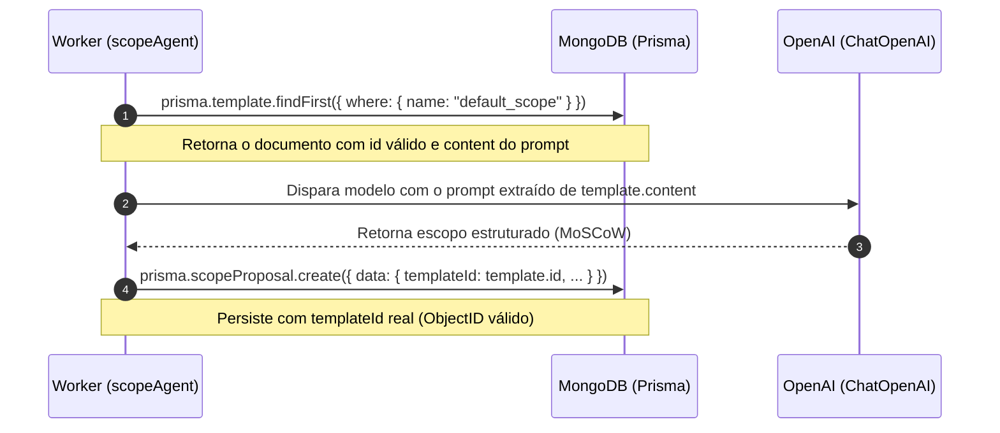

# Planejamento: Gestão de Templates de Prompt no Banco de Dados (Append-Only & Seed)

Este documento detalha a estratégia de **Templates de Prompt e Resposta** no backend do **Context-Whisperer**, mantendo os templates como registros persistidos no MongoDB via scripts de Seed, imutáveis por design (Append-Only) e com seleção automatizada pelo backend para cada necessidade.

---

## 1. Princípios e Diretrizes Arquiteturais

### 🎯 1. Templates no Banco de Dados (Seed / Dump)
- Os templates são registros reais armazenados na collection `Template` do MongoDB.
- A carga inicial dos templates do sistema é feita via **script de Seed idempotente** (`pnpm run db:seed`).
- Não é necessário alterar a estrutura do modelo `Template` no Prisma: os campos `name`, `description` e `content` (onde reside o prompt/estrutura) já atendem com precisão.

### 🔒 2. Design Imutável (Append-Only)
- **Regra de Ouro:** Templates nunca sofrem `UPDATE` em produção.
- Se uma nova versão de prompt de escopo for desenvolvida no futuro, ela é inserida como um novo registro (novo ID/versão).
- **Vantagem:** Garante reprodutibilidade e fidelidade histórica. Uma proposta de escopo (`ScopeProposal`) gerada há 6 meses sempre apontará para o `templateId` exato e idêntico que a gerou.

### 🤖 3. Seleção Fixo-Automática pelo Backend (Sem Escolha do Usuário)
- O usuário final não escolhe templates nesta etapa.
- O backend determina o template ideal de acordo com a etapa do pipeline:
  - Etapa de Escopo: Template `default_scope`.
  - Etapa de Diagramas UML: Template `default_uml` (futuro).
  - Etapa de Arquitetura: Template `default_architecture` (futuro).

### 🔗 4. Relações no Prisma (`scopeProposals` e `artifacts`)
- As propriedades `artifacts Artifact[]` e `scopeProposals ScopeProposal[]` no `schema.prisma` são apenas convenções declarativas do Prisma para permitir buscas relacionais via TypeScript (`include: { template: true }`).
- **No MongoDB real:** O documento de `Template` armazena apenas seus dados (`_id`, `name`, `description`, `content`, datas). Nenhuma lista ou array pesado de propostas é persistido no documento de `Template`. A relação física vive exclusivamente na `ScopeProposal` através de `templateId`.

---

## 2. Fluxo de Execução no Worker (`scopeAgent`)

---

## 3. Roteiro de Implementação

### 📌 Fase 1: Script de Seed dos Templates (`packages/database`)
- Criar/configurar `packages/database/prisma/seed.ts`.
- Inserir de forma idempotente (`upsert` pelo `name: 'default_scope'`) o template padrão de geração de escopo com o prompt MoSCoW.
- Adicionar script no `packages/database/package.json` e no `package.json` raiz (`pnpm run db:seed`).

### 📌 Fase 2: Integração no Worker (`apps/worker`)
- No arquivo `scope-agent.node.ts`:
  - Consultar o template de escopo no MongoDB (`findFirst({ where: { name: 'default_scope' } })`).
  - Fallback defensivo: se por ventura o banco não tiver sido semeado, cria automaticamente o registro do `default_scope` para nunca travar a execução.
  - Utilizar o `template.content` para a instrução da IA.
  - Salvar `ScopeProposal` passando o `templateId: template.id` (garantindo um `ObjectId` de 24 caracteres válido).

### 📌 Fase 3: Ajuste de Testes Unitários e de Integração
- Atualizar os mocks de teste do Worker para retornar o mock de `template` com um `id` ObjectId válido (ex: `"66cd1234567890abcdef1234"`).
- Garantir 100% de sucesso em `pnpm run test:all`, `pnpm -r lint` e `pnpm -r build`.

### 📌 Fase 4: Validação em Tempo Real
- Executar `pnpm run db:seed`.
- Disparar `createProject` no GraphQL e confirmar que o Worker consome o job, consulta o template no MongoDB, salva a proposta com sucesso e emite `SCOPE_READY` no SSE sem falhas.
